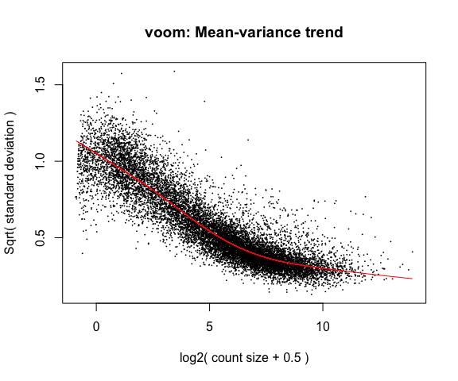
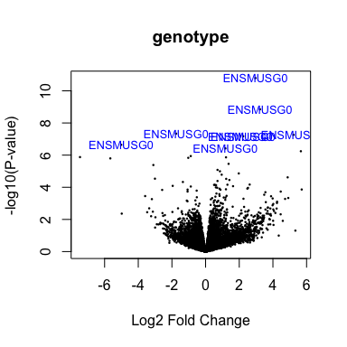
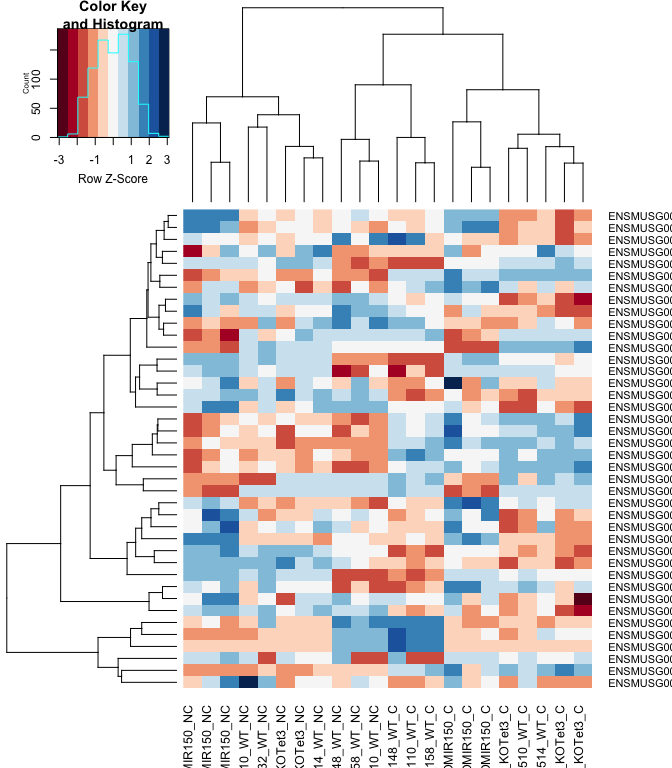
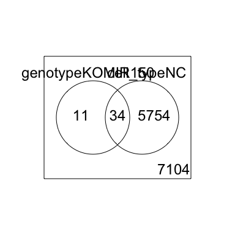

# Differential Gene Expression Analysis in R

* Differential Gene Expression (DGE) between conditions is determined from count data
* Generally speaking differential expression analysis is performed in a very similar manner to DNA microarrays, once normalization and transformations have been performed.

A lot of RNA-seq analysis has been done in R and so there are many packages available to analyze and view this data. Two of the most commonly used are:
* DESeq2, developed by Simon Anders (also created htseq) in Wolfgang Huber’s group at EMBL
* edgeR and Voom (extension to Limma [microarrays] for RNA-seq), developed out of Gordon Smyth’s group from the Walter and Eliza Hall Institute of Medical Research in Australia

xhttp://bioconductor.org/packages/release/BiocViews.html#___RNASeq

## Differential Expression Analysis with Limma-Voom

**limma** is an R package that was originally developed for differential expression (DE) analysis of gene expression microarray data.

**voom** is a function in the limma package that transforms RNA-Seq data for use with limma.

Together they allow fast, flexible, and powerful analyses of RNA-Seq data.  Limma-voom is _our_ tool of choice for DE analyses because it:

* Allows for incredibly flexible model specification (you can include multiple categorical and continuous variables, allowing incorporation of almost any kind of metadata).

* Based on simulation studies, maintains the false discovery rate at or below the nominal rate, unlike some other packages.

* Empirical Bayes smoothing of gene-wise standard deviations provides increased power.  

### Basic Steps of Differential Gene Expression
1. Read count data and annotation into R and preprocessing.
2. Calculate normalization factors (sample-specific adjustments)
3. Filter genes (uninteresting genes, e.g. unexpressed)
4. Account for expression-dependent variability by transformation, weighting, or modeling
5. Fitting a linear model
6. Perform statistical comparisons of interest (using contrasts)
7. Adjust for multiple testing, Benjamini-Hochberg (BH) or q-value
8. Check results for confidence
9. Attach annotation if available and write tables


## 1. Read in the counts table and create our DGEList (EdgeR)

```r
counts <- read.delim("rnaseq_workshop_counts_mm.txt", row.names = 1)
dim(counts) # number of genes
```

```
## [1] 55487    22
```

```r
head(counts)
```

```
##                    mouse_110_WT_C mouse_110_WT_NC mouse_148_WT_C
## ENSMUSG00000102693              0               0              0
## ENSMUSG00000064842              0               0              0
## ENSMUSG00000051951              0               0              0
## ENSMUSG00000102851              0               0              0
## ENSMUSG00000103377              0               0              0
## ENSMUSG00000104017              0               0              0
##                    mouse_148_WT_NC mouse_158_WT_C mouse_158_WT_NC
## ENSMUSG00000102693               0              0               0
## ENSMUSG00000064842               0              0               0
## ENSMUSG00000051951               0              0               0
## ENSMUSG00000102851               0              0               0
## ENSMUSG00000103377               0              0               0
## ENSMUSG00000104017               0              0               0
##                    mouse_183_KOMIR150_C mouse_183_KOMIR150_NC
## ENSMUSG00000102693                    0                     0
## ENSMUSG00000064842                    0                     0
## ENSMUSG00000051951                    0                     0
## ENSMUSG00000102851                    0                     0
## ENSMUSG00000103377                    0                     0
## ENSMUSG00000104017                    0                     0
##                    mouse_198_KOMIR150_C mouse_198_KOMIR150_NC
## ENSMUSG00000102693                    0                     0
## ENSMUSG00000064842                    0                     0
## ENSMUSG00000051951                    0                     0
## ENSMUSG00000102851                    0                     0
## ENSMUSG00000103377                    0                     0
## ENSMUSG00000104017                    0                     0
##                    mouse_206_KOMIR150_C mouse_206_KOMIR150_NC
## ENSMUSG00000102693                    0                     0
## ENSMUSG00000064842                    0                     0
## ENSMUSG00000051951                    0                     0
## ENSMUSG00000102851                    0                     0
## ENSMUSG00000103377                    0                     0
## ENSMUSG00000104017                    0                     0
##                    mouse_2670_KOTet3_C mouse_2670_KOTet3_NC mouse_7530_KOTet3_C
## ENSMUSG00000102693                   0                    0                   0
## ENSMUSG00000064842                   0                    0                   0
## ENSMUSG00000051951                   0                    0                   0
## ENSMUSG00000102851                   0                    0                   0
## ENSMUSG00000103377                   0                    0                   0
## ENSMUSG00000104017                   0                    0                   0
##                    mouse_7530_KOTet3_NC mouse_7531_KOTet3_C mouse_7532_WT_NC
## ENSMUSG00000102693                    0                   0                0
## ENSMUSG00000064842                    0                   0                0
## ENSMUSG00000051951                    0                   0                0
## ENSMUSG00000102851                    0                   0                0
## ENSMUSG00000103377                    0                   0                0
## ENSMUSG00000104017                    0                   0                0
##                    mouse_H510_WT_C mouse_H510_WT_NC mouse_H514_WT_C
## ENSMUSG00000102693               0                0               0
## ENSMUSG00000064842               0                0               0
## ENSMUSG00000051951               0                0               0
## ENSMUSG00000102851               0                0               0
## ENSMUSG00000103377               0                0               0
## ENSMUSG00000104017               0                0               0
##                    mouse_H514_WT_NC
## ENSMUSG00000102693                0
## ENSMUSG00000064842                0
## ENSMUSG00000051951                0
## ENSMUSG00000102851                0
## ENSMUSG00000103377                0
## ENSMUSG00000104017                0
```

Create Differential Gene Expression List Object (DGEList) object


```r
d0 <- DGEList(counts)
```
  
**1a\.** Read in Annotation

```r
anno <- read.delim("ensembl_mm_100.tsv",as.is=T)
dim(anno)
```

```
## [1] 56305    10
```

```r
head(anno)
```

```
##       Gene.stable.ID Gene.stable.ID.version
## 1 ENSMUSG00000064372   ENSMUSG00000064372.1
## 2 ENSMUSG00000064371   ENSMUSG00000064371.1
## 3 ENSMUSG00000064370   ENSMUSG00000064370.1
## 4 ENSMUSG00000064369   ENSMUSG00000064369.1
## 5 ENSMUSG00000064368   ENSMUSG00000064368.1
## 6 ENSMUSG00000064367   ENSMUSG00000064367.1
##                                                                  Gene.description
## 1         mitochondrially encoded tRNA proline [Source:MGI Symbol;Acc:MGI:102478]
## 2       mitochondrially encoded tRNA threonine [Source:MGI Symbol;Acc:MGI:102473]
## 3         mitochondrially encoded cytochrome b [Source:MGI Symbol;Acc:MGI:102501]
## 4   mitochondrially encoded tRNA glutamic acid [Source:MGI Symbol;Acc:MGI:102488]
## 5 mitochondrially encoded NADH dehydrogenase 6 [Source:MGI Symbol;Acc:MGI:102495]
## 6 mitochondrially encoded NADH dehydrogenase 5 [Source:MGI Symbol;Acc:MGI:102496]
##        Gene.type Transcript.count Gene...GC.content Chromosome.scaffold.name
## 1        Mt_tRNA                1             44.78                       MT
## 2        Mt_tRNA                1             34.33                       MT
## 3 protein_coding                1             39.07                       MT
## 4        Mt_tRNA                1             34.78                       MT
## 5 protein_coding                1             34.10                       MT
## 6 protein_coding                1             37.12                       MT
##   Gene.start..bp. Gene.end..bp. Strand
## 1           15356         15422     -1
## 2           15289         15355      1
## 3           14145         15288      1
## 4           14071         14139     -1
## 5           13552         14070     -1
## 6           11742         13565      1
```

```r
tail(anno)
```

```
##           Gene.stable.ID Gene.stable.ID.version
## 56300 ENSMUSG00000116316   ENSMUSG00000116316.1
## 56301 ENSMUSG00000116327   ENSMUSG00000116327.1
## 56302 ENSMUSG00000116328   ENSMUSG00000116328.1
## 56303 ENSMUSG00000116379   ENSMUSG00000116379.1
## 56304 ENSMUSG00000116431   ENSMUSG00000116431.1
## 56305 ENSMUSG00000116507   ENSMUSG00000116507.1
##                                                Gene.description      Gene.type
## 56300 predicted gene, 48462 [Source:MGI Symbol;Acc:MGI:6097976]         lncRNA
## 56301           schlafen 14 [Source:MGI Symbol;Acc:MGI:2684866] protein_coding
## 56302                                                               pseudogene
## 56303                                                               pseudogene
## 56304            schlafen 3 [Source:MGI Symbol;Acc:MGI:1329005] protein_coding
## 56305 predicted gene, 23444 [Source:MGI Symbol;Acc:MGI:5453221]          snRNA
##       Transcript.count Gene...GC.content Chromosome.scaffold.name
## 56300                1             46.07 CHR_WSB_EIJ_MMCHR11_CTG3
## 56301                1             44.07 CHR_WSB_EIJ_MMCHR11_CTG3
## 56302                1             39.30 CHR_WSB_EIJ_MMCHR11_CTG3
## 56303                1             37.89 CHR_WSB_EIJ_MMCHR11_CTG3
## 56304                3             41.41 CHR_WSB_EIJ_MMCHR11_CTG3
## 56305                1             45.55 CHR_WSB_EIJ_MMCHR11_CTG3
##       Gene.start..bp. Gene.end..bp. Strand
## 56300        83088268      83092118      1
## 56301        83233324      83245134     -1
## 56302        83205141      83206056      1
## 56303        83206643      83207658      1
## 56304        83150467      83174093      1
## 56305        83229738      83229928      1
```

```r
any(duplicated(anno$Gene.stable.ID))
```

```
## [1] FALSE
```

**1b\.** Derive experiment metadata from the sample names

Our experiment has two factors, genotype ("WT", "KOMIR150", or "KOTet3") and cell type ("C" or "NC").

The sample names are "mouse" followed by an animal identifier, followed by the genotype, followed by the cell type.

```r
sample_names <- colnames(counts)
metadata <- as.data.frame(strsplit2(sample_names, c("_"))[,2:4], row.names = sample_names)
colnames(metadata) <- c("mouse", "genotype", "cell_type")
```

Create a new variable "group" that combines genotype and cell type.

```r
metadata$group <- interaction(metadata$genotype, metadata$cell_type)
table(metadata$group)
```

```
## 
##  KOMIR150.C    KOTet3.C        WT.C KOMIR150.NC   KOTet3.NC       WT.NC 
##           3           3           5           3           2           6
```

Note: you can also enter group information manually, or read it in from an external file.  If you do this, it is $VERY, VERY, VERY$ important that you make sure the metadata is in the same order as the column names of the counts table.

## 2. Preprocessing and Normalization factors

In differential expression analysis, only sample-specific effects need to be normalized, we are NOT concerned with comparisons and quantification of absolute expression.

* Sequence depth – is a sample specific effect and needs to be adjusted for.
* RNA composition - finding a set of scaling factors for the library sizes that minimize the log-fold changes between the samples for most genes (edgeR uses a trimmed mean of M-values between each pair of sample)
* GC content – is NOT sample-specific (except when it is)
* Gene Length – is NOT sample-specific (except when it is)

In edgeR/limma, you calculate normalization factors to scale the raw library sizes (number of reads) using the function calcNormFactors, which by default uses TMM (weighted trimmed means of M values to the reference). Assumes most genes are not DE.

Proposed by Robinson and Oshlack (2010).


```r
d0 <- calcNormFactors(d0)
d0$samples
```

```
##                       group lib.size norm.factors
## mouse_110_WT_C            1  2333947    1.0311936
## mouse_110_WT_NC           1  2832183    0.9890673
## mouse_148_WT_C            1  2808984    1.0223502
## mouse_148_WT_NC           1  2609400    0.9893831
## mouse_158_WT_C            1  2967165    1.0123008
## mouse_158_WT_NC           1  2653006    0.9665824
## mouse_183_KOMIR150_C      1  2530568    1.0254506
## mouse_183_KOMIR150_NC     1  1857925    0.9843995
## mouse_198_KOMIR150_C      1  2834316    1.0205393
## mouse_198_KOMIR150_NC     1  2916206    0.9830185
## mouse_206_KOMIR150_C      1  1386930    0.9952084
## mouse_206_KOMIR150_NC     1   952208    0.9911163
## mouse_2670_KOTet3_C       1  2898456    1.0009311
## mouse_2670_KOTet3_NC      1  2932701    0.9735538
## mouse_7530_KOTet3_C       1  2607047    1.0196309
## mouse_7530_KOTet3_NC      1  2878866    0.9534559
## mouse_7531_KOTet3_C       1  2659776    1.0222318
## mouse_7532_WT_NC          1  2709083    1.0024529
## mouse_H510_WT_C           1  2580303    1.0266600
## mouse_H510_WT_NC          1  2830542    1.0159632
## mouse_H514_WT_C           1  2296076    0.9943003
## mouse_H514_WT_NC          1  2644848    0.9850580
```

**Note:** calcNormFactors doesn't _normalize_ the data, it just calculates normalization factors for use downstream.

## 3. FilteHScoreg out genes

We filter genes based on non-experimental factors to reduce the number of genes/tests being conducted and therefor do not have to be accounted for in our transformation or multiple testing correction. Commonly we try to remove genes that are either a) unexpressed, or b) unchanging (low-variability).

Common filters include:
1. to remove genes with a max value (X) of less then Y.
2. to remove genes that are less than X normalized read counts (cpm) across a certain number of samples. Ex: rowSums(cpms <=1) < 3 , require at least 1 cpm in at least 3 samples to keep.
3. A less used filter is for genes with minimum variance across all samples, so if a gene isn't changing (constant expression) its inherently not interesting therefor no need to test.

Here we will filter low-expressed genes, remove any row (gene) whose max value (for the row) is less tha cutoff (3).

```r
cutoff <- 2
drop <- which(apply(cpm(d0), 1, max) < cutoff)
d <- d0[-drop,]
dim(d) # number of genes left
```

```
## [1] 12903    22
```

"Low-expressed" is subjective and depends on the dataset.

Visualizaing your data with a Multidimensional scaling (MDS) plot.

```r
plotMDS(d, col = as.numeric(metadata$group), cex=1)
```

<!-- -->

The MDS plot tells you **A LOT** about what to expect from your experiment.

**3a\.** Extracting "normalized" expression table

### RPKM vs. FPKM vs. CPM and Model Based
* RPKM - Reads per kilobase per million mapped reads
* FPKM - Fragments per kilobase per million mapped reads
* logCPM – log Counts per million [ good for producing MDS plots, estimate of normalized values in model based ]
* Model based - original read counts are not themselves transformed, but rather correction factors are used in the DE model itself.

We use the `cpm` function with log=TRUE to obtain log-transformed normalized expression data.  On the log scale, the data has less mean-dependent variability and is more suitable for plotting.

```r
logcpm <- cpm(d, prior.count=2, log=TRUE)
write.table(logcpm,"rnaseq_workshop_normalized_counts.txt",sep="\t",quote=F)
```


## 4. Voom transformation and calculation of variance weights

Specify the model to be fitted.  We do this before using voom since voom uses variances of the model residuals (observed - fitted)

```r
group <- metadata$group
mm <- model.matrix(~0 + group)
head(mm)
```

```
##   groupKOMIR150.C groupKOTet3.C groupWT.C groupKOMIR150.NC groupKOTet3.NC
## 1               0             0         1                0              0
## 2               0             0         0                0              0
## 3               0             0         1                0              0
## 4               0             0         0                0              0
## 5               0             0         1                0              0
## 6               0             0         0                0              0
##   groupWT.NC
## 1          0
## 2          1
## 3          0
## 4          1
## 5          0
## 6          1
```

The above specifies a model where each coefficient corresponds to a group mean.

**4a\.** **Voom**

```r
y <- voom(d, mm, plot = T)
```

<!-- -->

What is voom doing?

1. Counts are transformed to log2 counts per million reads (CPM), where "per million reads" is defined based on the normalization factors we calculated earlier.
2. A linear model is fitted to the log2 CPM for each gene, and the residuals are calculated.
3. A smoothed curve is fitted to the sqrt(residual standard deviation) by average expression.
(see red line in plot above)
4. The smoothed curve is used to obtain weights for each gene and sample that are passed into limma along with the log2 CPMs.

More details at "[voom: precision weights unlock linear model analysis tools for RNA-seq read counts](https://genomebiology.biomedcentral.com/articles/10.1186/gb-2014-15-2-r29)"

The above plot is a "good" voom plot.  If your voom plot looks like the below (performed on the raw data), you might want to filter more:

```r
tmp <- voom(d0, mm, plot = T)
```

<!-- -->


## 5. Fitting linear models in limma

lmFit fits a linear model using weighted least squares for each gene:

```r
fit <- lmFit(y, mm)
head(coef(fit))
```

```
##                    groupKOMIR150.C groupKOTet3.C groupWT.C groupKOMIR150.NC
## ENSMUSG00000098104       -0.470580    -0.3861565  0.225785        -0.346553
## ENSMUSG00000033845        4.665116     5.0039317  4.909629         4.926499
## ENSMUSG00000025903        5.446624     5.6304785  5.590660         5.601328
## ENSMUSG00000033813        5.793658     5.7811939  5.801911         5.879705
## ENSMUSG00000033793        5.162154     5.5691489  5.308025         5.032351
## ENSMUSG00000025907        6.530425     6.5914673  6.495564         6.382589
##                    groupKOTet3.NC groupWT.NC
## ENSMUSG00000098104     -0.5277469 -0.5901761
## ENSMUSG00000033845      4.7350378  4.7911115
## ENSMUSG00000025903      5.5965895  5.4695192
## ENSMUSG00000033813      6.0212511  5.8238639
## ENSMUSG00000033793      5.1287937  5.0169313
## ENSMUSG00000025907      6.6590543  6.2934527
```

Comparisons between groups (log fold-changes) are obtained as _contrasts_ of these fitted linear models:

## 6. Specify which groups to compare using contrasts:

Comparison between cell types for genotype WT.

```r
contr <- makeContrasts(groupWT.C - groupWT.NC, levels = colnames(coef(fit)))
contr
```

```
##                   Contrasts
## Levels             groupWT.C - groupWT.NC
##   groupKOMIR150.C                       0
##   groupKOTet3.C                         0
##   groupWT.C                             1
##   groupKOMIR150.NC                      0
##   groupKOTet3.NC                        0
##   groupWT.NC                           -1
```

**6a\.** Estimate contrast for each gene

```r
tmp <- contrasts.fit(fit, contr)
```

The variance characteristics of low expressed genes are different from high expressed genes, if treated the same, the effect is to over represent low expressed genes in the DE list.

Empirical Bayes smoothing of standard errors (shifts standard errors that are much larger or smaller than those from other genes towards the average standard error) (see "[Linear Models and Empirical Bayes Methods for Assessing Differential Expression in Microarray Experiments](https://www.degruyter.com/doi/10.2202/1544-6115.1027)"

**6b\.** Apply EBayes

```r
tmp <- eBayes(tmp)
```

## 7. Multiple Testing Adjustment

The TopTable. Ajust by Benjamini & Hochberg (BH), or its 'alias' fdr. "[Controlling the false discovery rate: a practical and powerful approach to multiple testing](http://www.jstor.org/stable/2346101).

here `n=Inf` says to produce the topTable for **all** genes. 

```r
top.table <- topTable(tmp, adjust.method = "BH", sort.by = "P", n = Inf)
```

### Multiple Testing Correction

\Simply a must! Best choices are:
  * [FDR](http://www.jstor.org/stable/2346101) (false discovery rate), such as Benjamini-Hochberg (1995).
  * [Qvalue](https://rss.onlinelibrary.wiley.com/doi/abs/10.1111/1467-9868.00346) - Storey (2002)

The FDR (or qvalue) is a statement about the list and is no longer about the gene (pvalue). So a FDR of 0.05, says you expect 5% false positives among the list of genes with an FDR of 0.05 or less.

The statement “Statistically significantly different” means FDR of 0.05 or less.

**7a\.** How many DE genes are there (false discovery rate corrected)?

```r
length(which(top.table$adj.P.Val < 0.05))
```

```
## [1] 4967
```

## 8. Check your results for confidence.

You've conducted an experiment, you've seen a phenotype. Now check which genes are most deferentially expressed (show the top 50)? Look up these top genes, their description and ensure they relate to your experiment/phenotype. 

```r
head(top.table, 50)
```

```
##                         logFC   AveExpr         t      P.Value    adj.P.Val
## ENSMUSG00000037185 -1.5506536  9.491794 -24.93839 9.057118e-18 1.168640e-13
## ENSMUSG00000030203 -4.1633310  7.005929 -23.48592 3.288834e-17 2.121791e-13
## ENSMUSG00000026193  4.7554574 10.155926  22.73911 6.570900e-17 2.232800e-13
## ENSMUSG00000023809 -3.1909902  4.835883 -22.68387 6.921801e-17 2.232800e-13
## ENSMUSG00000020608 -2.4405129  7.871119 -21.35095 2.519371e-16 5.422922e-13
## ENSMUSG00000028497  1.7033744  6.997496  21.26453 2.746416e-16 5.422922e-13
## ENSMUSG00000027215 -2.5587301  6.902097 -21.19586 2.941987e-16 5.422922e-13
## ENSMUSG00000021242  1.7407446  8.978626  20.81573 4.321412e-16 6.678055e-13
## ENSMUSG00000039109  4.6400670  8.324842  20.73144 4.710090e-16 6.678055e-13
## ENSMUSG00000030342 -3.7468634  6.049866 -20.53447 5.767255e-16 6.678055e-13
## ENSMUSG00000030789 -4.0816723  7.377861 -20.49610 6.000519e-16 6.678055e-13
## ENSMUSG00000023827 -2.0718889  6.418008 -20.39285 6.678389e-16 6.678055e-13
## ENSMUSG00000037820 -4.2685803  7.129001 -20.38569 6.728258e-16 6.678055e-13
## ENSMUSG00000023186  1.6281624  7.092217  20.14483 8.653673e-16 7.975596e-13
## ENSMUSG00000024164  1.8068531  9.873524  19.80947 1.234116e-15 1.061587e-12
## ENSMUSG00000019843 -2.3785564  7.146657 -19.41622 1.884227e-15 1.363226e-12
## ENSMUSG00000048498 -5.9567440  6.502558 -19.41446 1.887835e-15 1.363226e-12
## ENSMUSG00000051177  3.1351998  4.997819  19.40770 1.901733e-15 1.363226e-12
## ENSMUSG00000029490  3.5876463  5.976711  19.34994 2.025038e-15 1.375214e-12
## ENSMUSG00000051457 -2.2530102  9.825255 -19.14288 2.540049e-15 1.638712e-12
## ENSMUSG00000034641 -2.5296376  8.058596 -18.87825 3.404067e-15 2.091556e-12
## ENSMUSG00000027508 -1.8901184  8.124895 -18.74246 3.961511e-15 2.323426e-12
## ENSMUSG00000038147  1.6435136  7.150369  18.18989 7.418371e-15 4.161706e-12
## ENSMUSG00000044783 -1.6998581  7.454587 -18.11689 8.069516e-15 4.338373e-12
## ENSMUSG00000030427  3.1503025  5.100604  17.73755 1.255483e-14 6.479797e-12
## ENSMUSG00000021990 -2.6715605  8.368960 -17.56456 1.540093e-14 7.643010e-12
## ENSMUSG00000020340 -2.2443170  8.657028 -17.32302 2.054623e-14 9.818817e-12
## ENSMUSG00000020212 -2.1130989  6.785791 -17.23345 2.288425e-14 1.054555e-11
## ENSMUSG00000031902 -1.0996481  7.813507 -17.06900 2.792720e-14 1.242568e-11
## ENSMUSG00000059325  2.4295166  5.256802  16.87592 3.535850e-14 1.507766e-11
## ENSMUSG00000063410 -0.8515134  8.905677 -16.85622 3.622472e-14 1.507766e-11
## ENSMUSG00000018168 -3.8661030  5.468134 -16.81480 3.811879e-14 1.537021e-11
## ENSMUSG00000021728  1.5743129  8.398957  16.75201 4.118931e-14 1.610502e-11
## ENSMUSG00000052212  4.4820888  6.203043  16.65104 4.667883e-14 1.771462e-11
## ENSMUSG00000066682 -1.8359584  6.459165 -16.61084 4.907125e-14 1.809047e-11
## ENSMUSG00000021322  4.2102040  4.215230  16.41652 6.257715e-14 2.217645e-11
## ENSMUSG00000049103  2.0655508  9.892016  16.40372 6.359210e-14 2.217645e-11
## ENSMUSG00000029287 -3.8932029  5.416403 -16.35627 6.750988e-14 2.292316e-11
## ENSMUSG00000022584  4.7785049  6.747830  16.21017 8.122849e-14 2.687413e-11
## ENSMUSG00000016496 -3.6588370  6.411624 -16.05938 9.846407e-14 3.173657e-11
## ENSMUSG00000055541 -2.3846123  7.318770 -16.04074 1.008447e-13 3.173657e-11
## ENSMUSG00000020100  1.5283264  6.518218  16.00772 1.052114e-13 3.232244e-11
## ENSMUSG00000038807 -1.5239109  9.015470 -15.88811 1.227458e-13 3.683229e-11
## ENSMUSG00000035273  1.4317409  7.456855  15.82743 1.327809e-13 3.893800e-11
## ENSMUSG00000052713 -1.4067446  6.381553 -15.73407 1.499182e-13 4.298655e-11
## ENSMUSG00000039959 -1.4515386  8.944064 -15.69244 1.582881e-13 4.439982e-11
## ENSMUSG00000040723  1.0265200  7.087267  15.65866 1.654366e-13 4.541763e-11
## ENSMUSG00000029254 -2.4472622  6.698526 -15.49356 2.055396e-13 5.525161e-11
## ENSMUSG00000064254  2.1283972  5.015173  15.44962 2.178341e-13 5.736150e-11
## ENSMUSG00000054676  2.3018486  6.113943  15.33992 2.519828e-13 6.502667e-11
##                           B
## ENSMUSG00000037185 30.82469
## ENSMUSG00000030203 29.28920
## ENSMUSG00000026193 28.85197
## ENSMUSG00000023809 27.56174
## ENSMUSG00000020608 27.50909
## ENSMUSG00000028497 27.40800
## ENSMUSG00000027215 27.29308
## ENSMUSG00000021242 26.97393
## ENSMUSG00000039109 26.89196
## ENSMUSG00000030342 26.27800
## ENSMUSG00000030789 26.58967
## ENSMUSG00000023827 26.46478
## ENSMUSG00000037820 26.39930
## ENSMUSG00000023186 26.28316
## ENSMUSG00000024164 25.90473
## ENSMUSG00000019843 25.50802
## ENSMUSG00000048498 24.76451
## ENSMUSG00000051177 24.94902
## ENSMUSG00000029490 25.26429
## ENSMUSG00000051457 25.18022
## ENSMUSG00000034641 24.92319
## ENSMUSG00000027508 24.76896
## ENSMUSG00000038147 24.14978
## ENSMUSG00000044783 24.06547
## ENSMUSG00000030427 23.27724
## ENSMUSG00000021990 23.40594
## ENSMUSG00000020340 23.10346
## ENSMUSG00000020212 23.03062
## ENSMUSG00000031902 22.81237
## ENSMUSG00000059325 22.45443
## ENSMUSG00000063410 22.51427
## ENSMUSG00000018168 22.30919
## ENSMUSG00000021728 22.39959
## ENSMUSG00000052212 22.25108
## ENSMUSG00000066682 22.27043
## ENSMUSG00000021322 20.92832
## ENSMUSG00000049103 21.89239
## ENSMUSG00000029287 21.69047
## ENSMUSG00000022584 21.75659
## ENSMUSG00000016496 21.55457
## ENSMUSG00000055541 21.54408
## ENSMUSG00000020100 21.50923
## ENSMUSG00000038807 21.27384
## ENSMUSG00000035273 21.24701
## ENSMUSG00000052713 21.16369
## ENSMUSG00000039959 21.01814
## ENSMUSG00000040723 21.04090
## ENSMUSG00000029254 20.84939
## ENSMUSG00000064254 20.70157
## ENSMUSG00000054676 20.64910
```
Columns are
* logFC: log2 fold change of WT.C/WT.NC
* AveExpr: Average expression across all samples, in log2 CPM
* t: logFC divided by its standard error
* P.Value: Raw p-value (based on t) from test that logFC differs from 0
* adj.P.Val: Benjamini-Hochberg false discovery rate adjusted p-value
* B: log-odds that gene is DE (arguably less useful than the other columns)

ENSMUSG00000030203 has higher expression at WT NC than at WT C (logFC is netative).  ENSMUSG00000026193 has higher expression at WT C than at WT NC (logFC is positive).


## 9. Write top.table to a file, adding in cpms and annotation

```r
top.table$Gene <- rownames(top.table)
top.table <- top.table[,c("Gene", names(top.table)[1:6])]
top.table <- data.frame(top.table,anno[match(top.table$Gene,anno$Gene.stable.ID),],logcpm[match(top.table$Gene,rownames(logcpm)),])

head(top.table)
```

```
##                                  Gene     logFC   AveExpr         t
## ENSMUSG00000037185 ENSMUSG00000037185 -1.550654  9.491794 -24.93839
## ENSMUSG00000030203 ENSMUSG00000030203 -4.163331  7.005929 -23.48592
## ENSMUSG00000026193 ENSMUSG00000026193  4.755457 10.155926  22.73911
## ENSMUSG00000023809 ENSMUSG00000023809 -3.190990  4.835883 -22.68387
## ENSMUSG00000020608 ENSMUSG00000020608 -2.440513  7.871119 -21.35095
## ENSMUSG00000028497 ENSMUSG00000028497  1.703374  6.997496  21.26453
##                         P.Value    adj.P.Val        B     Gene.stable.ID
## ENSMUSG00000037185 9.057118e-18 1.168640e-13 30.82469 ENSMUSG00000037185
## ENSMUSG00000030203 3.288834e-17 2.121791e-13 29.28920 ENSMUSG00000030203
## ENSMUSG00000026193 6.570900e-17 2.232800e-13 28.85197 ENSMUSG00000026193
## ENSMUSG00000023809 6.921801e-17 2.232800e-13 27.56174 ENSMUSG00000023809
## ENSMUSG00000020608 2.519371e-16 5.422922e-13 27.50909 ENSMUSG00000020608
## ENSMUSG00000028497 2.746416e-16 5.422922e-13 27.40800 ENSMUSG00000028497
##                    Gene.stable.ID.version
## ENSMUSG00000037185   ENSMUSG00000037185.9
## ENSMUSG00000030203  ENSMUSG00000030203.17
## ENSMUSG00000026193  ENSMUSG00000026193.15
## ENSMUSG00000023809  ENSMUSG00000023809.10
## ENSMUSG00000020608   ENSMUSG00000020608.7
## ENSMUSG00000028497  ENSMUSG00000028497.12
##                                                                                  Gene.description
## ENSMUSG00000037185                                 keratin 80 [Source:MGI Symbol;Acc:MGI:1921377]
## ENSMUSG00000030203            dual specificity phosphatase 16 [Source:MGI Symbol;Acc:MGI:1917936]
## ENSMUSG00000026193                                fibronectin 1 [Source:MGI Symbol;Acc:MGI:95566]
## ENSMUSG00000023809 ribosomal protein S6 kinase, polypeptide 2 [Source:MGI Symbol;Acc:MGI:1342290]
## ENSMUSG00000020608    structural maintenance of chromosomes 6 [Source:MGI Symbol;Acc:MGI:1914491]
## ENSMUSG00000028497            3-hydroxyacyl-CoA dehydratase 4 [Source:MGI Symbol;Acc:MGI:1914025]
##                         Gene.type Transcript.count Gene...GC.content
## ENSMUSG00000037185 protein_coding                5             52.83
## ENSMUSG00000030203 protein_coding                7             41.74
## ENSMUSG00000026193 protein_coding               17             43.66
## ENSMUSG00000023809 protein_coding                5             48.88
## ENSMUSG00000020608 protein_coding               12             38.40
## ENSMUSG00000028497 protein_coding                3             40.13
##                    Chromosome.scaffold.name Gene.start..bp. Gene.end..bp.
## ENSMUSG00000037185                       15       101347444     101370162
## ENSMUSG00000030203                        6       134715468     134792625
## ENSMUSG00000026193                        1        71585520      71653200
## ENSMUSG00000023809                       17         7170115       7303315
## ENSMUSG00000020608                       12        11265886      11319785
## ENSMUSG00000028497                        4        88396144      88438928
##                    Strand mouse_110_WT_C mouse_110_WT_NC mouse_148_WT_C
## ENSMUSG00000037185     -1       8.626060       10.259286       8.723930
## ENSMUSG00000030203     -1       5.016457        8.985832       5.195966
## ENSMUSG00000026193     -1      12.936863        7.938552      12.387790
## ENSMUSG00000023809      1       3.047586        6.509490       3.534069
## ENSMUSG00000020608      1       6.645200        9.077340       7.041320
## ENSMUSG00000028497     -1       7.887475        6.194907       7.853679
##                    mouse_148_WT_NC mouse_158_WT_C mouse_158_WT_NC
## ENSMUSG00000037185       10.277354       8.850372       10.461195
## ENSMUSG00000030203        9.079834       5.461716        9.210334
## ENSMUSG00000026193        7.987113      12.507053        7.399709
## ENSMUSG00000023809        6.643117       3.916969        6.691385
## ENSMUSG00000020608        9.419612       6.772457        9.195058
## ENSMUSG00000028497        6.083201       8.057799        6.299789
##                    mouse_183_KOMIR150_C mouse_183_KOMIR150_NC
## ENSMUSG00000037185             8.717099             10.433594
## ENSMUSG00000030203             5.239699              8.932223
## ENSMUSG00000026193            12.842316              6.964684
## ENSMUSG00000023809             3.434119              6.592053
## ENSMUSG00000020608             6.809393              9.326751
## ENSMUSG00000028497             7.738146              5.821691
##                    mouse_198_KOMIR150_C mouse_198_KOMIR150_NC
## ENSMUSG00000037185             8.738291             10.411449
## ENSMUSG00000030203             4.812550              9.204500
## ENSMUSG00000026193            12.637143              7.705250
## ENSMUSG00000023809             3.289536              6.504440
## ENSMUSG00000020608             6.502647              8.986687
## ENSMUSG00000028497             7.758337              6.147817
##                    mouse_206_KOMIR150_C mouse_206_KOMIR150_NC
## ENSMUSG00000037185             8.905915             10.246852
## ENSMUSG00000030203             5.237953              9.481721
## ENSMUSG00000026193            12.837113              8.817368
## ENSMUSG00000023809             3.006154              6.364199
## ENSMUSG00000020608             6.442998              8.912437
## ENSMUSG00000028497             7.843778              6.186704
##                    mouse_2670_KOTet3_C mouse_2670_KOTet3_NC mouse_7530_KOTet3_C
## ENSMUSG00000037185            8.373698            10.146098            8.388975
## ENSMUSG00000030203            4.943796             9.897021            4.052182
## ENSMUSG00000026193           12.173347             6.476560           13.012131
## ENSMUSG00000023809            2.489281             7.275165            2.406974
## ENSMUSG00000020608            6.594147             9.524842            6.435640
## ENSMUSG00000028497            8.069387             6.181689            7.772172
##                    mouse_7530_KOTet3_NC mouse_7531_KOTet3_C mouse_7532_WT_NC
## ENSMUSG00000037185            10.218848            8.632645        10.350694
## ENSMUSG00000030203             9.471160            4.085108         9.011048
## ENSMUSG00000026193             6.299259           13.047141         8.136359
## ENSMUSG00000023809             7.067474            2.815950         6.392457
## ENSMUSG00000020608             9.362773            6.272220         8.847690
## ENSMUSG00000028497             6.345236            7.739728         6.051662
##                    mouse_H510_WT_C mouse_H510_WT_NC mouse_H514_WT_C
## ENSMUSG00000037185        8.750697        10.302330        8.838088
## ENSMUSG00000030203        4.151878         9.019364        4.827041
## ENSMUSG00000026193       12.936927         8.337577       12.504389
## ENSMUSG00000023809        3.243597         6.559656        3.320164
## ENSMUSG00000020608        6.446816         8.997937        6.487160
## ENSMUSG00000028497        7.875481         6.265735        7.718373
##                    mouse_H514_WT_NC
## ENSMUSG00000037185        10.195988
## ENSMUSG00000030203         9.184640
## ENSMUSG00000026193         7.601687
## ENSMUSG00000023809         6.525762
## ENSMUSG00000020608         9.177007
## ENSMUSG00000028497         6.218865
```

```r
write.table(top.table, file = "WT.C_v_WT.NC.txt", row.names = F, sep = "\t", quote = F)
```
# Linear models and contrasts

Let's say we want to compare genotypes for cell type C.  The only thing we have to change is the call to makeContrasts:

```r
contr <- makeContrasts(groupWT.C - groupKOMIR150.C, levels = colnames(coef(fit)))
tmp <- contrasts.fit(fit, contr)
tmp <- eBayes(tmp)
top.table <- topTable(tmp, sort.by = "P", n = Inf)
head(top.table, 20)
```

```
##                         logFC     AveExpr          t      P.Value    adj.P.Val
## ENSMUSG00000030703 -3.2412892  4.82133950 -16.399986 6.389197e-14 8.243981e-10
## ENSMUSG00000028619  2.9846563  4.69288685  12.996253 7.080405e-12 4.567923e-08
## ENSMUSG00000040139 -1.3417248  3.73445510  -8.605597 1.557479e-08 6.698718e-05
## ENSMUSG00000025402 -1.5677998  4.27462041  -8.064070 4.725817e-08 1.524431e-04
## ENSMUSG00000114133 -3.9883638 -0.06740431  -7.731409 9.528349e-08 2.458886e-04
## ENSMUSG00000035212 -0.7213866  7.12916087  -7.629478 1.184731e-07 2.547764e-04
## ENSMUSG00000042105 -0.8743066  7.47937424  -7.516335 1.511242e-07 2.785651e-04
## ENSMUSG00000025464 -1.0746523  3.54168224  -6.884253 6.074148e-07 9.796842e-04
## ENSMUSG00000030748  2.1405617  7.07775200   6.213676 2.810366e-06 4.029129e-03
## ENSMUSG00000039018 -1.2849830  3.80603793  -6.098099 3.679654e-06 4.747857e-03
## ENSMUSG00000015806  1.2687921  3.53861354   5.707951 9.239084e-06 1.083745e-02
## ENSMUSG00000066684 -0.7309946  6.55028405  -5.216109 3.011785e-05 3.238422e-02
## ENSMUSG00000042396  0.7123263  6.75168109   4.902450 6.461134e-05 6.412924e-02
## ENSMUSG00000040711 -0.7301457  4.00780711  -4.811891 8.062462e-05 7.430710e-02
## ENSMUSG00000038155  3.0692870 -0.19543345   4.624795 1.275269e-04 1.024222e-01
## ENSMUSG00000048534  1.9080539  4.74871691   4.593550 1.376910e-04 1.024222e-01
## ENSMUSG00000032038  0.4241071  7.36534818   4.593234 1.377980e-04 1.024222e-01
## ENSMUSG00000106219 -3.2595602 -1.35675901  -4.578477 1.428815e-04 1.024222e-01
## ENSMUSG00000041408 -0.3491833  7.43116321  -4.511710 1.683385e-04 1.140861e-01
## ENSMUSG00000008305 -0.7693159  5.25315596  -4.490687 1.772607e-04 1.140861e-01
##                             B
## ENSMUSG00000030703 20.0872291
## ENSMUSG00000028619 13.2074559
## ENSMUSG00000040139  9.2831171
## ENSMUSG00000025402  8.4336903
## ENSMUSG00000114133  3.0717924
## ENSMUSG00000035212  7.7910925
## ENSMUSG00000042105  7.5432610
## ENSMUSG00000025464  6.1421919
## ENSMUSG00000030748  4.7563669
## ENSMUSG00000039018  4.3967015
## ENSMUSG00000015806  3.1786021
## ENSMUSG00000066684  2.4453351
## ENSMUSG00000042396  1.6616883
## ENSMUSG00000040711  1.5671751
## ENSMUSG00000038155 -1.5067427
## ENSMUSG00000048534  1.0725644
## ENSMUSG00000032038  0.8561902
## ENSMUSG00000106219 -1.0774656
## ENSMUSG00000041408  0.6414638
## ENSMUSG00000008305  0.8662154
```

```r
length(which(top.table$adj.P.Val < 0.05)) # number of DE genes
```

```
## [1] 12
```

```r
top.table$Gene <- rownames(top.table)
top.table <- top.table[,c("Gene", names(top.table)[1:6])]
top.table <- data.frame(top.table,anno[match(top.table$Gene,anno$Gene.stable.ID),],logcpm[match(top.table$Gene,rownames(logcpm)),])

write.table(top.table, file = "WT.C_v_KOMIR150.C.txt", row.names = F, sep = "\t", quote = F)
```

## What if we refit our model as a two-factor model (rather than using the group variable)?

Create new model matrix:

```r
genotype <- factor(metadata$genotype, levels = c("WT", "KOMIR150", "KOTet3"))
cell_type <- factor(metadata$cell_type, levels = c("C", "NC"))
mm <- model.matrix(~genotype*cell_type)
```

We are specifying that model includes effects for genotype, cell type, and the genotype-cell type interaction (which allows the differences between genotypes to differ across cell types).


```r
colnames(mm)
```

```
## [1] "(Intercept)"                  "genotypeKOMIR150"            
## [3] "genotypeKOTet3"               "cell_typeNC"                 
## [5] "genotypeKOMIR150:cell_typeNC" "genotypeKOTet3:cell_typeNC"
```

```r
y <- voom(d, mm, plot = F)
fit <- lmFit(y, mm)
head(coef(fit))
```

```
##                    (Intercept) genotypeKOMIR150 genotypeKOTet3 cell_typeNC
## ENSMUSG00000098104    0.225785     -0.696365050    -0.61194150 -0.81596112
## ENSMUSG00000033845    4.909629     -0.244513062     0.09430301 -0.11851725
## ENSMUSG00000025903    5.590660     -0.144035405     0.03981892 -0.12114034
## ENSMUSG00000033813    5.801911     -0.008253662    -0.02071728  0.02195266
## ENSMUSG00000033793    5.308025     -0.145871802     0.26112347 -0.29109420
## ENSMUSG00000025907    6.495564      0.034860971     0.09590337 -0.20211122
##                    genotypeKOMIR150:cell_typeNC genotypeKOTet3:cell_typeNC
## ENSMUSG00000098104                   0.93998818                 0.67437071
## ENSMUSG00000033845                   0.37990092                -0.15037669
## ENSMUSG00000025903                   0.27584406                 0.08725142
## ENSMUSG00000033813                   0.06409473                 0.21810455
## ENSMUSG00000033793                   0.16129161                -0.14926104
## ENSMUSG00000025907                   0.05427500                 0.26969819
```
* The coefficient genotypeKOMIR150 represents the difference in mean expression between KOMIR150 and the reference genotype (WT), _for cell type C_ (the reference level for cell type)
* The coefficient cell_typeNC represents the difference in mean expression between cell type NC and cell type C, _for genotype WT_
* The coefficient genotypeKOMIR150:cell_typeNC is the difference between cell types NC and C of the differences between genotypes KOMIR150 and WT (the interaction effect).

Let's estimate the difference between genotypes WT and KOMIR150 in cell type C.

```r
tmp <- contrasts.fit(fit, coef = 2) # Directly test second coefficient
tmp <- eBayes(tmp)
top.table <- topTable(tmp, sort.by = "P", n = Inf)
head(top.table, 20)
```

```
##                         logFC     AveExpr          t      P.Value    adj.P.Val
## ENSMUSG00000030703  3.2412892  4.82133950  16.399986 6.389197e-14 8.243981e-10
## ENSMUSG00000028619 -2.9846563  4.69288685 -12.996253 7.080405e-12 4.567923e-08
## ENSMUSG00000040139  1.3417248  3.73445510   8.605597 1.557479e-08 6.698718e-05
## ENSMUSG00000025402  1.5677998  4.27462041   8.064070 4.725817e-08 1.524431e-04
## ENSMUSG00000114133  3.9883638 -0.06740431   7.731409 9.528349e-08 2.458886e-04
## ENSMUSG00000035212  0.7213866  7.12916087   7.629478 1.184731e-07 2.547764e-04
## ENSMUSG00000042105  0.8743066  7.47937424   7.516335 1.511242e-07 2.785651e-04
## ENSMUSG00000025464  1.0746523  3.54168224   6.884253 6.074148e-07 9.796842e-04
## ENSMUSG00000030748 -2.1405617  7.07775200  -6.213676 2.810366e-06 4.029129e-03
## ENSMUSG00000039018  1.2849830  3.80603793   6.098099 3.679654e-06 4.747857e-03
## ENSMUSG00000015806 -1.2687921  3.53861354  -5.707951 9.239084e-06 1.083745e-02
## ENSMUSG00000066684  0.7309946  6.55028405   5.216109 3.011785e-05 3.238422e-02
## ENSMUSG00000042396 -0.7123263  6.75168109  -4.902450 6.461134e-05 6.412924e-02
## ENSMUSG00000040711  0.7301457  4.00780711   4.811891 8.062462e-05 7.430710e-02
## ENSMUSG00000038155 -3.0692870 -0.19543345  -4.624795 1.275269e-04 1.024222e-01
## ENSMUSG00000048534 -1.9080539  4.74871691  -4.593550 1.376910e-04 1.024222e-01
## ENSMUSG00000032038 -0.4241071  7.36534818  -4.593234 1.377980e-04 1.024222e-01
## ENSMUSG00000106219  3.2595602 -1.35675901   4.578477 1.428815e-04 1.024222e-01
## ENSMUSG00000041408  0.3491833  7.43116321   4.511710 1.683385e-04 1.140861e-01
## ENSMUSG00000008305  0.7693159  5.25315596   4.490687 1.772607e-04 1.140861e-01
##                             B
## ENSMUSG00000030703 20.0872291
## ENSMUSG00000028619 13.2074559
## ENSMUSG00000040139  9.2831171
## ENSMUSG00000025402  8.4336903
## ENSMUSG00000114133  3.0717924
## ENSMUSG00000035212  7.7910925
## ENSMUSG00000042105  7.5432610
## ENSMUSG00000025464  6.1421919
## ENSMUSG00000030748  4.7563669
## ENSMUSG00000039018  4.3967015
## ENSMUSG00000015806  3.1786021
## ENSMUSG00000066684  2.4453351
## ENSMUSG00000042396  1.6616883
## ENSMUSG00000040711  1.5671751
## ENSMUSG00000038155 -1.5067427
## ENSMUSG00000048534  1.0725644
## ENSMUSG00000032038  0.8561902
## ENSMUSG00000106219 -1.0774656
## ENSMUSG00000041408  0.6414638
## ENSMUSG00000008305  0.8662154
```

```r
length(which(top.table$adj.P.Val < 0.05)) # number of DE genes
```

```
## [1] 12
```
We get the same results as with the model where each coefficient corresponded to a group mean.  In essence, these are the _same_ model, so use whichever is most convenient for what you are estimating.

The interaction effects genotypeKOMIR150:cell_typeNC are easier to estimate and test in this setup.

```r
head(coef(fit))
```

```
##                    (Intercept) genotypeKOMIR150 genotypeKOTet3 cell_typeNC
## ENSMUSG00000098104    0.225785     -0.696365050    -0.61194150 -0.81596112
## ENSMUSG00000033845    4.909629     -0.244513062     0.09430301 -0.11851725
## ENSMUSG00000025903    5.590660     -0.144035405     0.03981892 -0.12114034
## ENSMUSG00000033813    5.801911     -0.008253662    -0.02071728  0.02195266
## ENSMUSG00000033793    5.308025     -0.145871802     0.26112347 -0.29109420
## ENSMUSG00000025907    6.495564      0.034860971     0.09590337 -0.20211122
##                    genotypeKOMIR150:cell_typeNC genotypeKOTet3:cell_typeNC
## ENSMUSG00000098104                   0.93998818                 0.67437071
## ENSMUSG00000033845                   0.37990092                -0.15037669
## ENSMUSG00000025903                   0.27584406                 0.08725142
## ENSMUSG00000033813                   0.06409473                 0.21810455
## ENSMUSG00000033793                   0.16129161                -0.14926104
## ENSMUSG00000025907                   0.05427500                 0.26969819
```


```r
tmp <- contrasts.fit(fit, coef = 4) # Test genotypeKOMIR150:cell_typeNC
tmp <- eBayes(tmp)
top.table <- topTable(tmp, sort.by = "P", n = Inf)
head(top.table, 20)
```

```
##                        logFC   AveExpr         t      P.Value    adj.P.Val
## ENSMUSG00000037185  1.550654  9.491794  24.93839 9.057118e-18 1.168640e-13
## ENSMUSG00000030203  4.163331  7.005929  23.48592 3.288834e-17 2.121791e-13
## ENSMUSG00000026193 -4.755457 10.155926 -22.73911 6.570900e-17 2.232800e-13
## ENSMUSG00000023809  3.190990  4.835883  22.68387 6.921801e-17 2.232800e-13
## ENSMUSG00000020608  2.440513  7.871119  21.35095 2.519371e-16 5.422922e-13
## ENSMUSG00000028497 -1.703374  6.997496 -21.26453 2.746416e-16 5.422922e-13
## ENSMUSG00000027215  2.558730  6.902097  21.19586 2.941987e-16 5.422922e-13
## ENSMUSG00000021242 -1.740745  8.978626 -20.81573 4.321412e-16 6.678055e-13
## ENSMUSG00000039109 -4.640067  8.324842 -20.73144 4.710090e-16 6.678055e-13
## ENSMUSG00000030342  3.746863  6.049866  20.53447 5.767255e-16 6.678055e-13
## ENSMUSG00000030789  4.081672  7.377861  20.49610 6.000519e-16 6.678055e-13
## ENSMUSG00000023827  2.071889  6.418008  20.39285 6.678389e-16 6.678055e-13
## ENSMUSG00000037820  4.268580  7.129001  20.38569 6.728258e-16 6.678055e-13
## ENSMUSG00000023186 -1.628162  7.092217 -20.14483 8.653673e-16 7.975596e-13
## ENSMUSG00000024164 -1.806853  9.873524 -19.80947 1.234116e-15 1.061587e-12
## ENSMUSG00000019843  2.378556  7.146657  19.41622 1.884227e-15 1.363226e-12
## ENSMUSG00000048498  5.956744  6.502558  19.41446 1.887835e-15 1.363226e-12
## ENSMUSG00000051177 -3.135200  4.997819 -19.40770 1.901733e-15 1.363226e-12
## ENSMUSG00000029490 -3.587646  5.976711 -19.34994 2.025038e-15 1.375214e-12
## ENSMUSG00000051457  2.253010  9.825255  19.14288 2.540049e-15 1.638712e-12
##                           B
## ENSMUSG00000037185 30.82469
## ENSMUSG00000030203 29.28920
## ENSMUSG00000026193 28.85197
## ENSMUSG00000023809 27.56174
## ENSMUSG00000020608 27.50909
## ENSMUSG00000028497 27.40800
## ENSMUSG00000027215 27.29308
## ENSMUSG00000021242 26.97393
## ENSMUSG00000039109 26.89196
## ENSMUSG00000030342 26.27800
## ENSMUSG00000030789 26.58967
## ENSMUSG00000023827 26.46478
## ENSMUSG00000037820 26.39930
## ENSMUSG00000023186 26.28316
## ENSMUSG00000024164 25.90473
## ENSMUSG00000019843 25.50802
## ENSMUSG00000048498 24.76451
## ENSMUSG00000051177 24.94902
## ENSMUSG00000029490 25.26429
## ENSMUSG00000051457 25.18022
```

```r
length(which(top.table$adj.P.Val < 0.05))
```

```
## [1] 4967
```

The log fold change here is the difference between genotypes KOMIR150 and WT in the log fold changes between cell types NC and C.

A gene for which this interaction effect is significant is one for which the effect of cell type differs between genotypes, and for which the effect of genotypes differs between cell types.

### More complicated models
Specifying a different model is simply a matter of changing the calls to model.matrix (and possibly to contrasts.fit).

Let's say we are interested in the effect of variation between mice. To adjust for mouse ID in the analysis, add mouse to the end of the call to model matrix.  Everything else about the code stays the same:

```r
mouse <- metadata$mouse
mm <- model.matrix(~0 + group + mouse)
y <- voom(d, mm, plot = F)
```

```
## Coefficients not estimable: mouse206 mouse7531
```

```
## Warning: Partial NA coefficients for 12903 probe(s)
```

```r
fit <- lmFit(y, mm)
```

```
## Coefficients not estimable: mouse206 mouse7531
```

```
## Warning: Partial NA coefficients for 12903 probe(s)
```

```r
contr <- makeContrasts(groupKOMIR150.NC - groupWT.NC,
                       levels = colnames(coef(fit)))
tmp <- contrasts.fit(fit, contr)
tmp <- eBayes(tmp)
top.table <- topTable(tmp, sort.by = "P", n = Inf)
head(top.table, 20)
```

```
##                         logFC  AveExpr         t      P.Value    adj.P.Val
## ENSMUSG00000030703  3.2474179 4.821340 17.327004 1.887197e-12 2.435051e-08
## ENSMUSG00000044229  3.1984546 6.841409 11.813682 9.178004e-10 5.921189e-06
## ENSMUSG00000066687  1.8448737 4.936269 10.156943 9.358872e-09 4.025251e-05
## ENSMUSG00000032012  5.4966464 5.016293  9.550099 2.350476e-08 7.582047e-05
## ENSMUSG00000008348  1.3179371 6.316519  8.952777 6.060270e-08 1.563913e-04
## ENSMUSG00000096780  5.6392505 2.397366  7.584675 6.255865e-07 1.345324e-03
## ENSMUSG00000030365 -1.0496641 6.697487 -7.386835 8.946025e-07 1.562403e-03
## ENSMUSG00000040152  3.0155848 6.455610  7.343209 9.687066e-07 1.562403e-03
## ENSMUSG00000030577  2.7797150 4.192767  7.175657 1.318161e-06 1.889803e-03
## ENSMUSG00000070372  0.9117687 7.412905  6.940857 2.042752e-06 2.635763e-03
## ENSMUSG00000028173 -1.8170423 6.814401 -6.825775 2.538926e-06 2.978160e-03
## ENSMUSG00000028028 -0.8112656 7.303105 -6.566925 4.167911e-06 4.481547e-03
## ENSMUSG00000035212  0.8049178 7.129161  6.496961 4.772900e-06 4.737287e-03
## ENSMUSG00000067017 -3.8612959 3.135964 -6.391137 5.866278e-06 5.406613e-03
## ENSMUSG00000020893  1.0885629 7.546165  6.135404 9.717239e-06 8.358769e-03
## ENSMUSG00000028037 -5.9594583 2.357328 -6.063323 1.122029e-05 9.048462e-03
## ENSMUSG00000033863  1.5062665 4.617791  5.939327 1.439289e-05 1.059751e-02
## ENSMUSG00000020108  0.7202245 6.955183  5.919780 1.497184e-05 1.059751e-02
## ENSMUSG00000042105  0.6752550 7.479374  5.899274 1.560510e-05 1.059751e-02
## ENSMUSG00000028619 -2.8263940 4.692887 -5.663973 2.519897e-05 1.584405e-02
##                            B
## ENSMUSG00000030703 17.944514
## ENSMUSG00000044229 12.664909
## ENSMUSG00000066687 10.352885
## ENSMUSG00000032012  8.111082
## ENSMUSG00000008348  8.559425
## ENSMUSG00000096780  3.020955
## ENSMUSG00000030365  5.914525
## ENSMUSG00000040152  5.898105
## ENSMUSG00000030577  5.570601
## ENSMUSG00000070372  4.984639
## ENSMUSG00000028173  4.890649
## ENSMUSG00000028028  4.238762
## ENSMUSG00000035212  4.134017
## ENSMUSG00000067017  3.127463
## ENSMUSG00000020893  3.352331
## ENSMUSG00000028037  1.658536
## ENSMUSG00000033863  3.302573
## ENSMUSG00000020108  2.814882
## ENSMUSG00000042105  2.854188
## ENSMUSG00000028619  2.394061
```

```r
length(which(top.table$adj.P.Val < 0.05))
```

```
## [1] 35
```

What if we want to adjust for a continuous variable like some health score?

```r
# Generate example health data
set.seed(99)
HScore <- rnorm(n = 22, mean = 7.5, sd = 1)
HScore
```

```
##  [1] 7.713963 7.979658 7.587829 7.943859 7.137162 7.622674 6.636155 7.989624
##  [9] 7.135883 6.205758 6.754231 8.421550 8.250054 4.991446 4.459066 7.500266
## [17] 7.105981 5.754972 7.998631 7.770954 8.598922 8.252513
```

Model adjusting for HScore score:

```r
mm <- model.matrix(~0 + group + HScore)
y <- voom(d, mm, plot = F)
fit <- lmFit(y, mm)
contr <- makeContrasts(groupKOMIR150.NC - groupWT.NC,
                       levels = colnames(coef(fit)))
tmp <- contrasts.fit(fit, contr)
tmp <- eBayes(tmp)
top.table <- topTable(tmp, sort.by = "P", n = Inf)
head(top.table, 20)
```

```
##                         logFC     AveExpr          t      P.Value    adj.P.Val
## ENSMUSG00000028619 -2.8205258  4.69288685 -18.984308 7.952668e-15 1.026133e-10
## ENSMUSG00000030703  3.6830126  4.82133950  16.552599 1.232136e-13 7.949123e-10
## ENSMUSG00000035212  0.8916723  7.12916087   9.262442 6.435282e-09 2.767815e-05
## ENSMUSG00000114133  4.5399798 -0.06740431   8.785782 1.584910e-08 5.112522e-05
## ENSMUSG00000030847 -0.9998561  5.57730159  -8.368782 3.571696e-08 9.217118e-05
## ENSMUSG00000042105  0.8594781  7.47937424   7.321148 3.044917e-07 6.548095e-04
## ENSMUSG00000040139  1.2746538  3.73445510   7.098321 4.895105e-07 9.023077e-04
## ENSMUSG00000025464  1.2658794  3.54168224   6.205574 3.500221e-06 5.645419e-03
## ENSMUSG00000041959 -1.4187889  6.39328892  -5.965459 6.042621e-06 8.431855e-03
## ENSMUSG00000042396 -0.7581142  6.75168109  -5.931263 6.534802e-06 8.431855e-03
## ENSMUSG00000025402  1.2069953  4.27462041   5.873285 7.464862e-06 8.756283e-03
## ENSMUSG00000030748 -1.5464207  7.07775200  -5.813389 8.568266e-06 9.213028e-03
## ENSMUSG00000104795 -2.6474835  0.98245144  -5.752023 9.872097e-06 9.798436e-03
## ENSMUSG00000015806 -0.9820480  3.53861354  -5.664069 1.210276e-05 1.115442e-02
## ENSMUSG00000027236  0.6519635  5.19235425   5.516880 1.704972e-05 1.466617e-02
## ENSMUSG00000068015 -0.4189118  6.23976372  -5.461282 1.941683e-05 1.565846e-02
## ENSMUSG00000047250  1.9053102  1.75580119   5.190913 3.668484e-05 2.784379e-02
## ENSMUSG00000106099 -1.4704270  3.05330998  -5.152651 4.016124e-05 2.878892e-02
## ENSMUSG00000104969 -2.6250629  2.06308354  -5.114978 4.391060e-05 2.887109e-02
## ENSMUSG00000071714 -0.7366313  6.70586931  -5.092091 4.635981e-05 2.887109e-02
##                            B
## ENSMUSG00000028619 22.198631
## ENSMUSG00000030703 20.335268
## ENSMUSG00000035212 10.606406
## ENSMUSG00000114133  5.996063
## ENSMUSG00000030847  8.975875
## ENSMUSG00000042105  6.708062
## ENSMUSG00000040139  6.412643
## ENSMUSG00000025464  4.564997
## ENSMUSG00000041959  3.818247
## ENSMUSG00000042396  3.672634
## ENSMUSG00000025402  3.848398
## ENSMUSG00000030748  3.350132
## ENSMUSG00000104795  2.533236
## ENSMUSG00000015806  3.401618
## ENSMUSG00000027236  2.904579
## ENSMUSG00000068015  2.635431
## ENSMUSG00000047250  2.304285
## ENSMUSG00000106099  2.261063
## ENSMUSG00000104969  1.970536
## ENSMUSG00000071714  1.715349
```

```r
length(which(top.table$adj.P.Val < 0.05))
```

```
## [1] 26
```

What if we want to look at the correlation of gene expression with a continuous variable like pH?

```r
# Generate example pH data
set.seed(99)
pH <- rnorm(n = 22, mean = 8, sd = 1.5)
pH
```

```
##  [1] 8.320944 8.719487 8.131743 8.665788 7.455743 8.184011 6.704232 8.734436
##  [9] 7.453825 6.058637 6.881346 9.382326 9.125082 4.237169 3.438599 8.000399
## [17] 7.408972 5.382459 8.747947 8.406431 9.648382 9.128770
```

Specify model matrix:

```r
mm <- model.matrix(~pH)
head(mm)
```

```
##   (Intercept)       pH
## 1           1 8.320944
## 2           1 8.719487
## 3           1 8.131743
## 4           1 8.665788
## 5           1 7.455743
## 6           1 8.184011
```


```r
y <- voom(d, mm, plot = F)
fit <- lmFit(y, mm)
tmp <- contrasts.fit(fit, coef = 2) # test "pH" coefficient
tmp <- eBayes(tmp)
top.table <- topTable(tmp, sort.by = "P", n = Inf)
head(top.table, 20)
```

```
##                          logFC     AveExpr         t      P.Value adj.P.Val
## ENSMUSG00000056054 -1.14981868  1.06857912 -4.975190 0.0000488960 0.6309051
## ENSMUSG00000026822 -1.12081883  1.27270019 -4.521273 0.0001517723 0.9013943
## ENSMUSG00000094497 -0.93690422 -0.61870341 -4.392222 0.0002095778 0.9013943
## ENSMUSG00000027111 -0.51858782  2.40389109 -4.100279 0.0004345719 0.9999158
## ENSMUSG00000069049 -1.17769264  1.58296026 -4.076062 0.0004616182 0.9999158
## ENSMUSG00000069045 -1.19782398  2.08868289 -3.746770 0.0010454887 0.9999158
## ENSMUSG00000016356  0.26468567  1.70177109  3.711511 0.0011405547 0.9999158
## ENSMUSG00000031169  0.39672073  0.45435295  3.667707 0.0012705697 0.9999158
## ENSMUSG00000056071 -0.96260133  0.90851678 -3.638377 0.0013656529 0.9999158
## ENSMUSG00000085355  0.46218393 -0.03035176  3.623328 0.0014171139 0.9999158
## ENSMUSG00000036764 -0.32443537  0.30386676 -3.588377 0.0015440904 0.9999158
## ENSMUSG00000091537 -0.09582751  5.42595452 -3.548272 0.0017035641 0.9999158
## ENSMUSG00000046032 -0.07908601  5.17549674 -3.508171 0.0018791085 0.9999158
## ENSMUSG00000035877 -0.16514435  2.75518059 -3.461786 0.0021042761 0.9999158
## ENSMUSG00000015312 -0.13344785  3.29481773 -3.460206 0.0021123915 0.9999158
## ENSMUSG00000040521 -0.17482564  2.88462444 -3.448399 0.0021740197 0.9999158
## ENSMUSG00000090946 -0.10223067  5.81729197 -3.436764 0.0022364667 0.9999158
## ENSMUSG00000027132 -0.15633133  3.37135144 -3.436628 0.0022372078 0.9999158
## ENSMUSG00000062981 -0.11385832  4.78670211 -3.422498 0.0023154244 0.9999158
## ENSMUSG00000056673 -1.06989252  1.13623835 -3.398699 0.0024532293 0.9999158
##                             B
## ENSMUSG00000056054  0.1446661
## ENSMUSG00000026822 -0.4130356
## ENSMUSG00000094497 -1.8365476
## ENSMUSG00000027111 -0.5969832
## ENSMUSG00000069049 -0.7130561
## ENSMUSG00000069045 -1.1273597
## ENSMUSG00000016356 -2.4184660
## ENSMUSG00000031169 -3.0983980
## ENSMUSG00000056071 -1.9187161
## ENSMUSG00000085355 -3.3145738
## ENSMUSG00000036764 -2.6496526
## ENSMUSG00000091537 -1.1331356
## ENSMUSG00000046032 -1.2229053
## ENSMUSG00000035877 -1.7310327
## ENSMUSG00000015312 -1.5649560
## ENSMUSG00000040521 -1.7101938
## ENSMUSG00000090946 -1.3634606
## ENSMUSG00000027132 -1.5839777
## ENSMUSG00000062981 -1.4084909
## ENSMUSG00000056673 -2.0456912
```

```r
length(which(top.table$adj.P.Val < 0.05))
```

```
## [1] 0
```

In this case, limma is fitting a linear regression model, which here is a straight line fit, with the slope and intercept defined by the model coefficients:

```r
ENSMUSG00000056054 <- y$E["ENSMUSG00000056054",]
plot(ENSMUSG00000056054 ~ pH, ylim = c(0, 3.5))
intercept <- coef(fit)["ENSMUSG00000056054", "(Intercept)"]
slope <- coef(fit)["ENSMUSG00000056054", "pH"]
abline(a = intercept, b = slope)
```

<!-- -->

```r
slope
```

```
## [1] -1.149819
```

In this example, the log fold change logFC is the slope of the line, or the change in gene expression (on the log2 CPM scale) for each unit increase in pH.

Here, a logFC of 0.20 means a 0.20 log2 CPM increase in gene expression for each unit increase in pH, or a 15% increase on the CPM scale (2^0.20 = 1.15).

### A bit more on linear models

Limma fits a linear model to each gene.

Linear models include analysis of variance (ANOVA) models, linear regression, and any model of the form

$$Y = \beta_0 + \beta_{1}X_{1} + \beta_{2}X_{2} + \dots + \beta_{p}X_{p} + \epsilon$$
The covariates X can be:

* a continuous variable (pH, HScore score, age, weight, temperature, etc.)
* Dummy variables coding a categorical covariate (like factor1, factor2, and group)

The $\beta$'s are unknown parameters to be estimated.

In limma, the $\beta$'s are the log fold changes.  

The error (residual) term $\epsilon$ is assumed to be normally distributed with a variance that is constant across the range of the data.

Normally distributed means the residuals come from a distribution that looks like this:
<!-- -->

The log2 transformation that voom applies to the counts makes the data "normal enough", but doesn't completely stabilize the variance:

```r
tmp <- voom(d, mm, plot = T)
```

<!-- -->

The log2 counts per million are more variable at lower expression levels.  The variance weights calculated by voom address this situation.

### Both edgeR and limma have VERY comprehensive user manuals

The limma users' guide has great details on model specification.

* [Limma voom](https://bioconductor.org/packages/release/bioc/vignettes/limma/inst/doc/usersguide.pdf)

* [edgeR](http://bioconductor.org/packages/release/bioc/vignettes/edgeR/inst/doc/edgeRUsersGuide.pdf)


# Simple plotting


```r
mm <- model.matrix(~genotype*cell_type)
colnames(mm) <- make.names(colnames(mm))
y <- voom(d, mm, plot = F)
fit <- lmFit(y, mm)
contrast.matrix <- makeContrasts(genotypeKOMIR150, cell_typeNC, levels=colnames(coef(fit)))
fit2 <- contrasts.fit(fit, contrast.matrix)
fit2 <- eBayes(fit2)
top.table <- topTable(fit2, coef = 1, sort.by = "P", n = 40)
```

## Volcano plot


```r
volcanoplot(fit2, coef=1, highlight=8, names=fit$genes$NAME, main="genotype")
```

<!-- -->

## Heatmap

```r
#using a red and blue color scheme without traces and scaling each row
heatmap.2(logcpm[rownames(top.table),],col=brewer.pal(11,"RdBu"),scale="row", trace="none")
```

<!-- -->

## 2 factor venn diagram


```r
results <- decideTests(fit2)
vennDiagram(results)
```

<!-- -->

## Download the Enrichment Analysis R Markdown document

```r
download.file("https://raw.githubusercontent.com/ucdavis-bioinformatics-training/2020-mRNA_Seq_Workshop/master/data_analysis/enrichment.Rmd", "enrichment.Rmd")
```


```r
sessionInfo()
```

```
## R version 4.0.2 (2020-06-22)
## Platform: x86_64-apple-darwin17.0 (64-bit)
## Running under: macOS Catalina 10.15.6
## 
## Matrix products: default
## BLAS:   /Library/Frameworks/R.framework/Versions/4.0/Resources/lib/libRblas.dylib
## LAPACK: /Library/Frameworks/R.framework/Versions/4.0/Resources/lib/libRlapack.dylib
## 
## locale:
## [1] en_US.UTF-8/en_US.UTF-8/en_US.UTF-8/C/en_US.UTF-8/en_US.UTF-8
## 
## attached base packages:
## [1] stats     graphics  grDevices utils     datasets  methods   base     
## 
## other attached packages:
## [1] gplots_3.0.4       RColorBrewer_1.1-2 edgeR_3.30.3       limma_3.44.3      
## 
## loaded via a namespace (and not attached):
##  [1] Rcpp_1.0.5         locfit_1.5-9.4     lattice_0.20-41    gtools_3.8.2      
##  [5] digest_0.6.25      bitops_1.0-6       grid_4.0.2         magrittr_1.5      
##  [9] evaluate_0.14      KernSmooth_2.23-17 rlang_0.4.7        stringi_1.4.6     
## [13] gdata_2.18.0       rmarkdown_2.3      tools_4.0.2        stringr_1.4.0     
## [17] xfun_0.16          yaml_2.2.1         compiler_4.0.2     caTools_1.18.0    
## [21] htmltools_0.5.0    knitr_1.29
```
