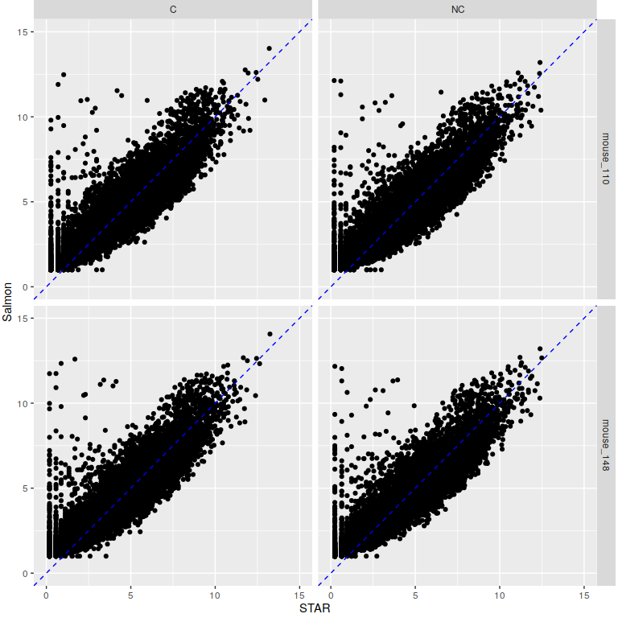
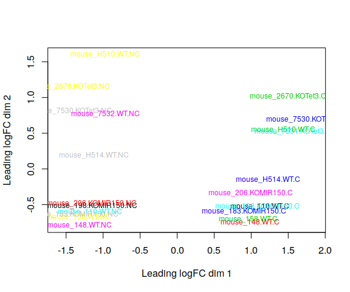
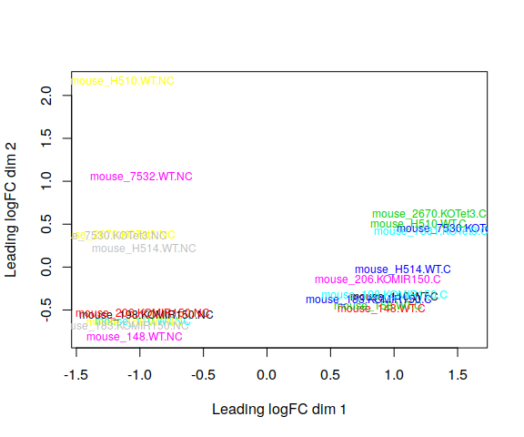

### Pairwise correlations of normalized counts on same sample using genes present in both star and sample counts

<!-- -->

(Figure shows 4 samples, these are representative of pattern on remaining samples.)

Note the pattern of genes with low expression with STAR and high expression with Salmon.

### MDS plot, STAR counts:
<!-- -->

### MDS plot, Salmon counts
<!-- -->

### Top 10 genes with STAR

### Top 10 genes with Salmon

0 genes are DE (adjusted P < 0.05) with STAR, and 0 genes are DE with Salmon.

### Conclusions
* STAR and Salmon show differences in quantification of low expressed genes.
* This does not seem to have much impact on the relative distances between samples or differential expression (note that low expressed genes are often filtered out before analysis).
* Pick one approach for a project and go with it.
* Don't run multiple analyses and pick the one that gives you the most DE genes.

