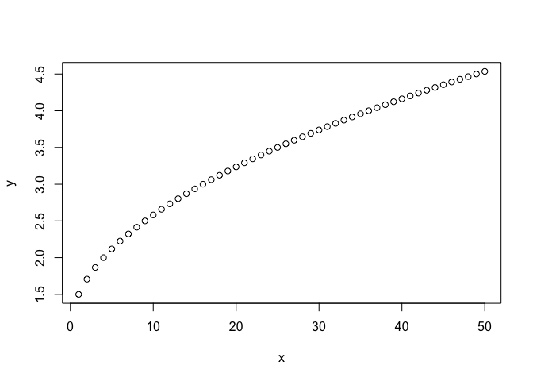
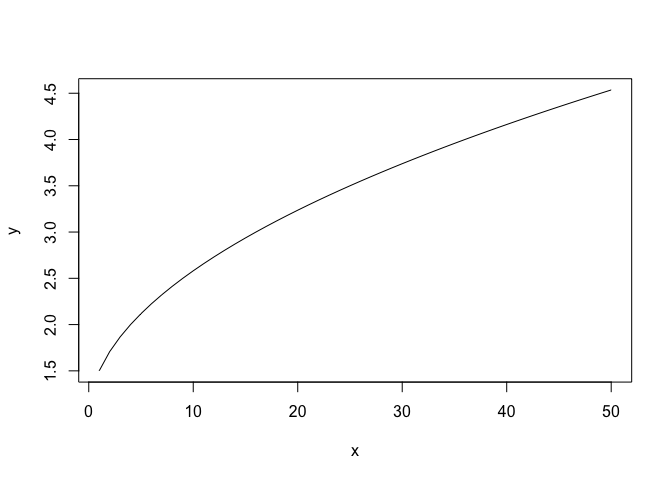
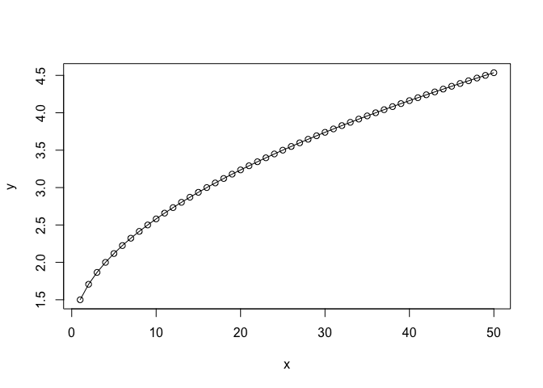
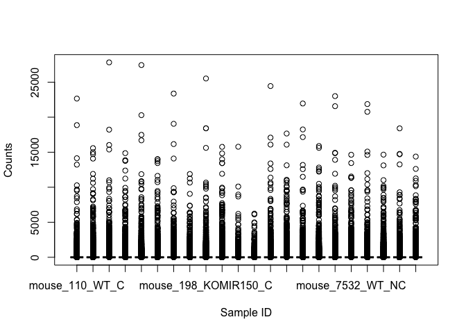
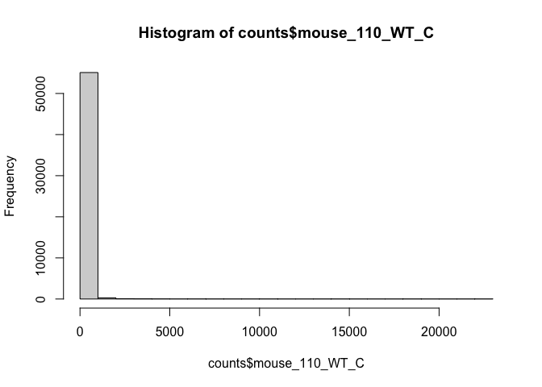
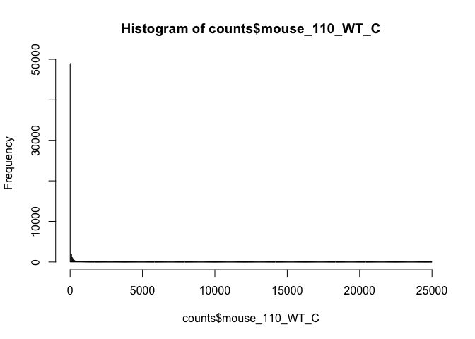
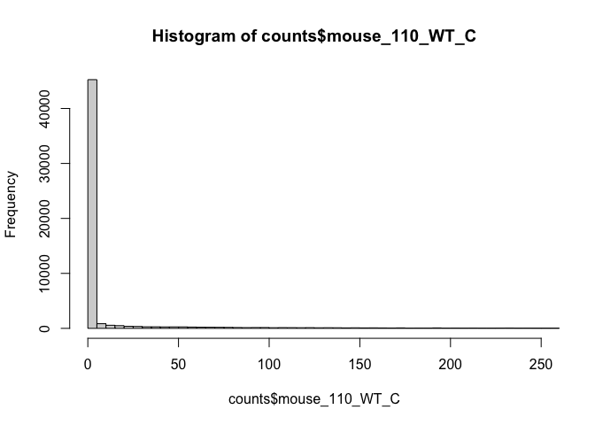

---

Topics covered in this introduction to R
====================================================
1. Basic concepts
2. Basic data types in R
3. Import and export data in R
4. Functions in R
5. Basic statistics in R
6. Simple data visulization in R
7. Install packages in R
8. Save data in R session


---

Topic 1. Basic concepts
====================================================

There are three concepts that we should be familiar with before working in R:

* Operators
* Functions
* Variables

### Operators

<table class="table table-striped" style="width: auto !important; ">
<caption>Assignment Operators in R</caption>
 <thead>
  <tr>
   <th style="text-align:center;"> Operator </th>
   <th style="text-align:center;"> Description </th>
  </tr>
 </thead>
<tbody>
  <tr>
   <td style="text-align:center;"> &lt;-, = </td>
   <td style="text-align:center;"> Assignment </td>
  </tr>
</tbody>
</table>

<table class="table table-striped" style="width: auto !important; ">
<caption>Arithmetic Operators in R</caption>
 <thead>
  <tr>
   <th style="text-align:center;"> Operator </th>
   <th style="text-align:center;"> Description </th>
  </tr>
 </thead>
<tbody>
  <tr>
   <td style="text-align:center;"> + </td>
   <td style="text-align:center;"> Addition </td>
  </tr>
  <tr>
   <td style="text-align:center;"> - </td>
   <td style="text-align:center;"> Subtraction </td>
  </tr>
  <tr>
   <td style="text-align:center;"> * </td>
   <td style="text-align:center;"> Multiplication </td>
  </tr>
  <tr>
   <td style="text-align:center;"> / </td>
   <td style="text-align:center;"> Division </td>
  </tr>
  <tr>
   <td style="text-align:center;"> ^ </td>
   <td style="text-align:center;"> Exponent </td>
  </tr>
  <tr>
   <td style="text-align:center;"> %% </td>
   <td style="text-align:center;"> Modulus </td>
  </tr>
  <tr>
   <td style="text-align:center;"> %/% </td>
   <td style="text-align:center;"> Integer Division </td>
  </tr>
</tbody>
</table>

<table class="table table-striped" style="width: auto !important; ">
<caption>Relational Operators in R</caption>
 <thead>
  <tr>
   <th style="text-align:center;"> Operator </th>
   <th style="text-align:center;"> Description </th>
  </tr>
 </thead>
<tbody>
  <tr>
   <td style="text-align:center;"> &lt; </td>
   <td style="text-align:center;"> Less than </td>
  </tr>
  <tr>
   <td style="text-align:center;"> &gt; </td>
   <td style="text-align:center;"> Greater than </td>
  </tr>
  <tr>
   <td style="text-align:center;"> &lt;= </td>
   <td style="text-align:center;"> Less than or equal to </td>
  </tr>
  <tr>
   <td style="text-align:center;"> &gt;= </td>
   <td style="text-align:center;"> Greater than or equal to </td>
  </tr>
  <tr>
   <td style="text-align:center;"> == </td>
   <td style="text-align:center;"> Equal to </td>
  </tr>
  <tr>
   <td style="text-align:center;"> != </td>
   <td style="text-align:center;"> Not equal to </td>
  </tr>
</tbody>
</table>

<table class="table table-striped" style="width: auto !important; ">
<caption>Logical Operators in R</caption>
 <thead>
  <tr>
   <th style="text-align:center;"> Operator </th>
   <th style="text-align:center;"> Description </th>
  </tr>
 </thead>
<tbody>
  <tr>
   <td style="text-align:center;"> ! </td>
   <td style="text-align:center;"> Logical NOT </td>
  </tr>
  <tr>
   <td style="text-align:center;"> &amp; </td>
   <td style="text-align:center;"> Element-wise logical AND </td>
  </tr>
  <tr>
   <td style="text-align:center;"> &amp;&amp; </td>
   <td style="text-align:center;"> Logical AND </td>
  </tr>
  <tr>
   <td style="text-align:center;"> | </td>
   <td style="text-align:center;"> Element-wise logical OR </td>
  </tr>
  <tr>
   <td style="text-align:center;"> || </td>
   <td style="text-align:center;"> Logical OR </td>
  </tr>
</tbody>
</table>

### Functions

Functions are essential in all programming languages. A function takes zero or more parameters and return a result. The way to use a function in R is:

function.name(parameter1=value1, ...)

```r
read.delim("rnaseq_workshop_counts_mm.txt", row.names = 1)
```
<table class="table table-striped" style="width: auto !important; ">
 <thead>
  <tr>
   <th style="text-align:left;">   </th>
   <th style="text-align:right;"> mouse_110_WT_C </th>
   <th style="text-align:right;"> mouse_110_WT_NC </th>
   <th style="text-align:right;"> mouse_148_WT_C </th>
   <th style="text-align:right;"> mouse_148_WT_NC </th>
   <th style="text-align:right;"> mouse_158_WT_C </th>
   <th style="text-align:right;"> mouse_158_WT_NC </th>
   <th style="text-align:right;"> mouse_183_KOMIR150_C </th>
   <th style="text-align:right;"> mouse_183_KOMIR150_NC </th>
   <th style="text-align:right;"> mouse_198_KOMIR150_C </th>
   <th style="text-align:right;"> mouse_198_KOMIR150_NC </th>
   <th style="text-align:right;"> mouse_206_KOMIR150_C </th>
   <th style="text-align:right;"> mouse_206_KOMIR150_NC </th>
   <th style="text-align:right;"> mouse_2670_KOTet3_C </th>
   <th style="text-align:right;"> mouse_2670_KOTet3_NC </th>
   <th style="text-align:right;"> mouse_7530_KOTet3_C </th>
   <th style="text-align:right;"> mouse_7530_KOTet3_NC </th>
   <th style="text-align:right;"> mouse_7531_KOTet3_C </th>
   <th style="text-align:right;"> mouse_7532_WT_NC </th>
   <th style="text-align:right;"> mouse_H510_WT_C </th>
   <th style="text-align:right;"> mouse_H510_WT_NC </th>
   <th style="text-align:right;"> mouse_H514_WT_C </th>
   <th style="text-align:right;"> mouse_H514_WT_NC </th>
  </tr>
 </thead>
<tbody>
  <tr>
   <td style="text-align:left;"> ENSMUSG00000102693 </td>
   <td style="text-align:right;"> 0 </td>
   <td style="text-align:right;"> 0 </td>
   <td style="text-align:right;"> 0 </td>
   <td style="text-align:right;"> 0 </td>
   <td style="text-align:right;"> 0 </td>
   <td style="text-align:right;"> 0 </td>
   <td style="text-align:right;"> 0 </td>
   <td style="text-align:right;"> 0 </td>
   <td style="text-align:right;"> 0 </td>
   <td style="text-align:right;"> 0 </td>
   <td style="text-align:right;"> 0 </td>
   <td style="text-align:right;"> 0 </td>
   <td style="text-align:right;"> 0 </td>
   <td style="text-align:right;"> 0 </td>
   <td style="text-align:right;"> 0 </td>
   <td style="text-align:right;"> 0 </td>
   <td style="text-align:right;"> 0 </td>
   <td style="text-align:right;"> 0 </td>
   <td style="text-align:right;"> 0 </td>
   <td style="text-align:right;"> 0 </td>
   <td style="text-align:right;"> 0 </td>
   <td style="text-align:right;"> 0 </td>
  </tr>
  <tr>
   <td style="text-align:left;"> ENSMUSG00000064842 </td>
   <td style="text-align:right;"> 0 </td>
   <td style="text-align:right;"> 0 </td>
   <td style="text-align:right;"> 0 </td>
   <td style="text-align:right;"> 0 </td>
   <td style="text-align:right;"> 0 </td>
   <td style="text-align:right;"> 0 </td>
   <td style="text-align:right;"> 0 </td>
   <td style="text-align:right;"> 0 </td>
   <td style="text-align:right;"> 0 </td>
   <td style="text-align:right;"> 0 </td>
   <td style="text-align:right;"> 0 </td>
   <td style="text-align:right;"> 0 </td>
   <td style="text-align:right;"> 0 </td>
   <td style="text-align:right;"> 0 </td>
   <td style="text-align:right;"> 0 </td>
   <td style="text-align:right;"> 0 </td>
   <td style="text-align:right;"> 0 </td>
   <td style="text-align:right;"> 0 </td>
   <td style="text-align:right;"> 0 </td>
   <td style="text-align:right;"> 0 </td>
   <td style="text-align:right;"> 0 </td>
   <td style="text-align:right;"> 0 </td>
  </tr>
  <tr>
   <td style="text-align:left;"> ENSMUSG00000051951 </td>
   <td style="text-align:right;"> 0 </td>
   <td style="text-align:right;"> 0 </td>
   <td style="text-align:right;"> 0 </td>
   <td style="text-align:right;"> 0 </td>
   <td style="text-align:right;"> 0 </td>
   <td style="text-align:right;"> 0 </td>
   <td style="text-align:right;"> 0 </td>
   <td style="text-align:right;"> 0 </td>
   <td style="text-align:right;"> 0 </td>
   <td style="text-align:right;"> 0 </td>
   <td style="text-align:right;"> 0 </td>
   <td style="text-align:right;"> 0 </td>
   <td style="text-align:right;"> 0 </td>
   <td style="text-align:right;"> 0 </td>
   <td style="text-align:right;"> 0 </td>
   <td style="text-align:right;"> 0 </td>
   <td style="text-align:right;"> 0 </td>
   <td style="text-align:right;"> 0 </td>
   <td style="text-align:right;"> 0 </td>
   <td style="text-align:right;"> 0 </td>
   <td style="text-align:right;"> 0 </td>
   <td style="text-align:right;"> 0 </td>
  </tr>
  <tr>
   <td style="text-align:left;"> ENSMUSG00000102851 </td>
   <td style="text-align:right;"> 0 </td>
   <td style="text-align:right;"> 0 </td>
   <td style="text-align:right;"> 0 </td>
   <td style="text-align:right;"> 0 </td>
   <td style="text-align:right;"> 0 </td>
   <td style="text-align:right;"> 0 </td>
   <td style="text-align:right;"> 0 </td>
   <td style="text-align:right;"> 0 </td>
   <td style="text-align:right;"> 0 </td>
   <td style="text-align:right;"> 0 </td>
   <td style="text-align:right;"> 0 </td>
   <td style="text-align:right;"> 0 </td>
   <td style="text-align:right;"> 0 </td>
   <td style="text-align:right;"> 0 </td>
   <td style="text-align:right;"> 0 </td>
   <td style="text-align:right;"> 0 </td>
   <td style="text-align:right;"> 0 </td>
   <td style="text-align:right;"> 0 </td>
   <td style="text-align:right;"> 0 </td>
   <td style="text-align:right;"> 0 </td>
   <td style="text-align:right;"> 0 </td>
   <td style="text-align:right;"> 0 </td>
  </tr>
  <tr>
   <td style="text-align:left;"> ENSMUSG00000103377 </td>
   <td style="text-align:right;"> 0 </td>
   <td style="text-align:right;"> 0 </td>
   <td style="text-align:right;"> 0 </td>
   <td style="text-align:right;"> 0 </td>
   <td style="text-align:right;"> 0 </td>
   <td style="text-align:right;"> 0 </td>
   <td style="text-align:right;"> 0 </td>
   <td style="text-align:right;"> 0 </td>
   <td style="text-align:right;"> 0 </td>
   <td style="text-align:right;"> 0 </td>
   <td style="text-align:right;"> 0 </td>
   <td style="text-align:right;"> 0 </td>
   <td style="text-align:right;"> 0 </td>
   <td style="text-align:right;"> 0 </td>
   <td style="text-align:right;"> 0 </td>
   <td style="text-align:right;"> 0 </td>
   <td style="text-align:right;"> 0 </td>
   <td style="text-align:right;"> 0 </td>
   <td style="text-align:right;"> 0 </td>
   <td style="text-align:right;"> 0 </td>
   <td style="text-align:right;"> 0 </td>
   <td style="text-align:right;"> 0 </td>
  </tr>
  <tr>
   <td style="text-align:left;"> ENSMUSG00000104017 </td>
   <td style="text-align:right;"> 0 </td>
   <td style="text-align:right;"> 0 </td>
   <td style="text-align:right;"> 0 </td>
   <td style="text-align:right;"> 0 </td>
   <td style="text-align:right;"> 0 </td>
   <td style="text-align:right;"> 0 </td>
   <td style="text-align:right;"> 0 </td>
   <td style="text-align:right;"> 0 </td>
   <td style="text-align:right;"> 0 </td>
   <td style="text-align:right;"> 0 </td>
   <td style="text-align:right;"> 0 </td>
   <td style="text-align:right;"> 0 </td>
   <td style="text-align:right;"> 0 </td>
   <td style="text-align:right;"> 0 </td>
   <td style="text-align:right;"> 0 </td>
   <td style="text-align:right;"> 0 </td>
   <td style="text-align:right;"> 0 </td>
   <td style="text-align:right;"> 0 </td>
   <td style="text-align:right;"> 0 </td>
   <td style="text-align:right;"> 0 </td>
   <td style="text-align:right;"> 0 </td>
   <td style="text-align:right;"> 0 </td>
  </tr>
</tbody>
</table>

### Variables

A variable is a named storage. The name of a variable can have letters, numbers, dot and underscore. However, a valid variable name cannot start with a underscore or a number, or start with a dot that is followed by a number.

Using an assignment operator, we can store the results of a function inside a variable.


```r
counts <- read.delim("rnaseq_workshop_counts_mm.txt", row.names = 1)
```

##### CHALLENGE

Which of the following assignments will work? Do you notice anything different about the behavior of any of these variables?

* a <- 1
* b = 2
* .c <- 3
* 1a <- 4
* .1a <- 5
* a.1 <- 6

---

Topic 2. Basic data types in R
====================================================


<table class="table table-striped" style="width: auto !important; ">
<caption>Basic Data Types</caption>
 <thead>
  <tr>
   <th style="text-align:center;"> Type </th>
   <th style="text-align:center;"> Example </th>
  </tr>
 </thead>
<tbody>
  <tr>
   <td style="text-align:center;"> Numeric </td>
   <td style="text-align:center;"> 3, 3e-2 </td>
  </tr>
  <tr>
   <td style="text-align:center;"> Character </td>
   <td style="text-align:center;"> "ENSMUSG00000102693" </td>
  </tr>
  <tr>
   <td style="text-align:center;"> Logical </td>
   <td style="text-align:center;"> TRUE, FALSE </td>
  </tr>
  <tr>
   <td style="text-align:center;"> Factor </td>
   <td style="text-align:center;"> any categorical variable </td>
  </tr>
</tbody>
</table>

### Simple variables: variables that have a numeric value, a character value (such as a string), or a logical value (True or False)

We can check the type of data stored within a variable using the class function.

```r
a <- 1
class(a)
```

```
## [1] "numeric"
```

```r
a <- "ENSMUSG00000102693"
class(a)
```

```
## [1] "character"
```

##### CHALLENGE

Try the following assignments. What is the class of each of the variables produced? Why? What is happening when converting between types using the as.numeric, as.logical, and as.character functions?

* a <- 150
* b <- 3e-2
* c <- "ENSMUSG00000102693"
* d <- TRUE
* e <- a < 1
* f <- b < 1
* g <- is.numeric(a)
* h <- is.character(a)
* i <- as.numeric(d)
* j <- as.character(a)
* l <- as.logical(b)
* m <- as.numeric(f)
* n <- as.logical(0)

### Vectors: a vector is a combination of multiple values(numeric, character or logical) in the same object. A vector is created using the function c() (for concatenate).

The values in the vector must all be of the same type.

```r
gene_ids <- c("ENSMUSG00000102693", "ENSMUSG00000064842", "ENSMUSG00000051951")
gene_ids
```

```
## [1] "ENSMUSG00000102693" "ENSMUSG00000064842" "ENSMUSG00000051951"
```

```r
of_interest <- c(TRUE, FALSE, FALSE)
of_interest
```

```
## [1]  TRUE FALSE FALSE
```

```r
length(of_interest)
```

```
## [1] 3
```

Elements of a vector can be named by providing names to an existing vector, or assigning names when creating a vector.

```r
names(of_interest) <- gene_ids
of_interest
```

```
## ENSMUSG00000102693 ENSMUSG00000064842 ENSMUSG00000051951
##               TRUE              FALSE              FALSE
```

```r
of_interest <- c(ENSMUSG00000102693 = TRUE, ENSMUSG00000064842 = FALSE, ENSMUSG00000051951 = FALSE)
of_interest
```

```
## ENSMUSG00000102693 ENSMUSG00000064842 ENSMUSG00000051951
##               TRUE              FALSE              FALSE
```

Elements of a vector can be accessed by index, or by name if it is a named vector. The element or elements to be accessed are specified using square brackets.

```r
of_interest[2]
```

```
## ENSMUSG00000064842
##              FALSE
```

```r
of_interest["ENSMUSG00000064842"]
```

```
## ENSMUSG00000064842
##              FALSE
```

```r
of_interest[c(1,3)]
```

```
## ENSMUSG00000102693 ENSMUSG00000051951
##               TRUE              FALSE
```

```r
of_interest[c("ENSMUSG00000102693", "ENSMUSG00000051951")]
```

```
## ENSMUSG00000102693 ENSMUSG00000051951
##               TRUE              FALSE
```

Additionally, a subset of a vector can be selected using a logical vector.

```r
gene_ids[of_interest]
```

```
## [1] "ENSMUSG00000102693"
```


##### <font color='red'>NOTE: a vector can only hold elements of the same type.</font>  

### Factors: a factor represents categorical or groups in data. The function factor() can be used to create a factor variable.


```r
treatment <- factor(c(1,2,1,2))
treatment
```

```
## [1] 1 2 1 2
## Levels: 1 2
```

```r
class(treatment)
```

```
## [1] "factor"
```

In R, categories are called factor levels. The function levels() can be used to access the factor levels.


```r
levels(treatment)
```

```
## [1] "1" "2"
```

Factor levels can also be changed by assigning new levels to a factor.


```r
levels(treatment) <- c("A", "C")
treatment
```

```
## [1] A C A C
## Levels: A C
```

Change the order of levels.


```r
levels(treatment) <- c("C", "A")
treatment
```

```
## [1] C A C A
## Levels: C A
```

By default, the order of factor levels is taken in the order of numeric or alphabetic.


```r
treatment <- factor(c("C", "A", "C", "A"))
treatment
```

```
## [1] C A C A
## Levels: A C
```

The factor levels can be specified when creating the factor, if the order does not follow the default rule.


```r
treatment <- factor(c("C", "A", "C", "A"), levels=c("C", "A"))
treatment
```

```
## [1] C A C A
## Levels: C A
```

If you want to know the number of individuals at each levels, there are two functions.


```r
summary(treatment)
```

```
## C A
## 2 2
```


```r
table(treatment)
```

```
## treatment
## C A
## 2 2
```

### Matrices: A matrix is like a speadsheet containing multiple rows and columns. It is used to combine vectors of the same type.


```r
col1 <- c(1,0,0,0)
col2 <- c(0,1,0,0)
col3 <- c(0,0,1,0)

my_matrix <- cbind(col1, col2, col3)
my_matrix
```

```
##      col1 col2 col3
## [1,]    1    0    0
## [2,]    0    1    0
## [3,]    0    0    1
## [4,]    0    0    0
```

```r
rownames(my_matrix) <- c("row1", "row2", "row3", "row4")
my_matrix
```

```
##      col1 col2 col3
## row1    1    0    0
## row2    0    1    0
## row3    0    0    1
## row4    0    0    0
```

```r
dim(my_matrix) # matrix dimensions
```

```
## [1] 4 3
```

```r
nrow(my_matrix)
```

```
## [1] 4
```

```r
ncol(my_matrix)
```

```
## [1] 3
```

```r
t(my_matrix) # transpose
```

```
##      row1 row2 row3 row4
## col1    1    0    0    0
## col2    0    1    0    0
## col3    0    0    1    0
```

Accessing elements of a matrix is done in similar ways to accessing elements of a vector.


```r
my_matrix[1,3]
```

```
## [1] 0
```

```r
my_matrix["row1", "col3"]
```

```
## [1] 0
```


```r
my_matrix[1,]
```

```
## col1 col2 col3
##    1    0    0
```

```r
my_matrix[,3]
```

```
## row1 row2 row3 row4
##    0    0    1    0
```


```r
my_matrix[col3 > 0,]
```

```
## col1 col2 col3
##    0    0    1
```

Matrices may be used in calculations. We will not be focusing on calculations or operations on matrices today, but you may want to explore the results of the code below later.


```r
my_matrix * 3
```

```
##      col1 col2 col3
## row1    3    0    0
## row2    0    3    0
## row3    0    0    3
## row4    0    0    0
```

```r
log10(my_matrix)
```

```
##      col1 col2 col3
## row1    0 -Inf -Inf
## row2 -Inf    0 -Inf
## row3 -Inf -Inf    0
## row4 -Inf -Inf -Inf
```

Total of each row.

```r
rowSums(my_matrix)
```

```
## row1 row2 row3 row4
##    1    1    1    0
```

Total of each column.

```r
colSums(my_matrix)
```

```
## col1 col2 col3
##    1    1    1
```

It is also possible to use the function apply() to apply any statistical functions to rows/columns of matrices. The advantage of using apply() is that it can take a function created by user.

The simplified format of apply() is as following:

apply(X, MARGIN, FUN)

X: data matrix
MARGIN: possible values are 1 (for rows) and 2 (for columns)
FUN: the function to apply on rows/columns

We can calculate the mean or the median of each row with the following:


```r
apply(my_matrix, 1, mean)
```

```
##      row1      row2      row3      row4
## 0.3333333 0.3333333 0.3333333 0.0000000
```

```r
apply(my_matrix, 1, median)
```

```
## row1 row2 row3 row4
##    0    0    0    0
```

##### CHALLENGE

How would you calculate the mean and median of each column, instead?

### Data frames: a data frame is like a matrix but can have columns with different types (numeric, character, logical).

A data frame can be created using the function data.frame(), from new or previously defined vectors.


```r
genes <- data.frame(ensembl = gene_ids, interest = of_interest)
genes
```

```
##                               ensembl interest
## ENSMUSG00000102693 ENSMUSG00000102693     TRUE
## ENSMUSG00000064842 ENSMUSG00000064842    FALSE
## ENSMUSG00000051951 ENSMUSG00000051951    FALSE
```

```r
genes <- data.frame(ensembl = c("ENSMUSG00000102693", "ENSMUSG00000064842", "ENSMUSG00000051951"), interest = c(TRUE, FALSE, FALSE))
genes
```

```
##              ensembl interest
## 1 ENSMUSG00000102693     TRUE
## 2 ENSMUSG00000064842    FALSE
## 3 ENSMUSG00000051951    FALSE
```

```r
is.data.frame(genes)
```

```
## [1] TRUE
```

To obtain a subset of a data frame can be done in similar ways to vectors and matrices: by index, by row or column names, or by logical values.


```r
genes[1,]
```

```
##              ensembl interest
## 1 ENSMUSG00000102693     TRUE
```

```r
genes[, "ensembl"]
```

```
## [1] "ENSMUSG00000102693" "ENSMUSG00000064842" "ENSMUSG00000051951"
```

```r
genes[of_interest,]
```

```
##              ensembl interest
## 1 ENSMUSG00000102693     TRUE
```

A column of a data frame can be specified using the "$".

```r
genes$ensembl
```

```
## [1] "ENSMUSG00000102693" "ENSMUSG00000064842" "ENSMUSG00000051951"
```

```r
genes[genes$interest,]
```

```
##              ensembl interest
## 1 ENSMUSG00000102693     TRUE
```

Data frames are easily extended using the "$" as well.


```r
genes$name <- c("4933401J01Rik", "Gm26206", "Xkr4")
genes
```

```
##              ensembl interest          name
## 1 ENSMUSG00000102693     TRUE 4933401J01Rik
## 2 ENSMUSG00000064842    FALSE       Gm26206
## 3 ENSMUSG00000051951    FALSE          Xkr4
```

When we used the function read.delim() at the very beginning, we created a data frame.


```r
class(counts)
```

```
## [1] "data.frame"
```
##### CHALLENGE

What type of data is stored in counts? Can you access a subset of that data? Can you add a column to counts? Explore counts using the following functions:
* rownames()
* colnames()
* class()

---

Topic 3. Import and export data in R
====================================================

R base function read.table() is a general function that can be used to read a file in table format. There are also several variants of read.table that can be used to make reading a file even easier, like read.delim, which we used above to create counts. The data will be imported as a data frame.


```r
# To read a local file, provide read.table with the path for to file location (same as taught in the command line session). Here we assume rnaseq_workshop_counts_mm.txt is in our current working directory
counts2 <- read.table(file="rnaseq_workshop_counts_mm.txt", sep="\t", header=T, stringsAsFactors=F)

# To read a file from the internet, provide read.table with the URL.
counts3 <- read.table(file="https://raw.githubusercontent.com/ucdavis-bioinformatics-training/2020-mRNA_Seq_Workshop/master/datasets/rnaseq_workshop_counts_mm.txt", sep="\t", header=T, stringsAsFactors=F)
```

Take a look at the beginning part of the data frame.

```r
head(counts2)
```

```
##                    mouse_110_WT_C mouse_110_WT_NC mouse_148_WT_C
## ENSMUSG00000102693              0               0              0
## ENSMUSG00000064842              0               0              0
## ENSMUSG00000051951              0               0              0
## ENSMUSG00000102851              0               0              0
## ENSMUSG00000103377              0               0              0
## ENSMUSG00000104017              0               0              0
##                    mouse_148_WT_NC mouse_158_WT_C mouse_158_WT_NC
## ENSMUSG00000102693               0              0               0
## ENSMUSG00000064842               0              0               0
## ENSMUSG00000051951               0              0               0
## ENSMUSG00000102851               0              0               0
## ENSMUSG00000103377               0              0               0
## ENSMUSG00000104017               0              0               0
##                    mouse_183_KOMIR150_C mouse_183_KOMIR150_NC
## ENSMUSG00000102693                    0                     0
## ENSMUSG00000064842                    0                     0
## ENSMUSG00000051951                    0                     0
## ENSMUSG00000102851                    0                     0
## ENSMUSG00000103377                    0                     0
## ENSMUSG00000104017                    0                     0
##                    mouse_198_KOMIR150_C mouse_198_KOMIR150_NC
## ENSMUSG00000102693                    0                     0
## ENSMUSG00000064842                    0                     0
## ENSMUSG00000051951                    0                     0
## ENSMUSG00000102851                    0                     0
## ENSMUSG00000103377                    0                     0
## ENSMUSG00000104017                    0                     0
##                    mouse_206_KOMIR150_C mouse_206_KOMIR150_NC
## ENSMUSG00000102693                    0                     0
## ENSMUSG00000064842                    0                     0
## ENSMUSG00000051951                    0                     0
## ENSMUSG00000102851                    0                     0
## ENSMUSG00000103377                    0                     0
## ENSMUSG00000104017                    0                     0
##                    mouse_2670_KOTet3_C mouse_2670_KOTet3_NC mouse_7530_KOTet3_C
## ENSMUSG00000102693                   0                    0                   0
## ENSMUSG00000064842                   0                    0                   0
## ENSMUSG00000051951                   0                    0                   0
## ENSMUSG00000102851                   0                    0                   0
## ENSMUSG00000103377                   0                    0                   0
## ENSMUSG00000104017                   0                    0                   0
##                    mouse_7530_KOTet3_NC mouse_7531_KOTet3_C mouse_7532_WT_NC
## ENSMUSG00000102693                    0                   0                0
## ENSMUSG00000064842                    0                   0                0
## ENSMUSG00000051951                    0                   0                0
## ENSMUSG00000102851                    0                   0                0
## ENSMUSG00000103377                    0                   0                0
## ENSMUSG00000104017                    0                   0                0
##                    mouse_H510_WT_C mouse_H510_WT_NC mouse_H514_WT_C
## ENSMUSG00000102693               0                0               0
## ENSMUSG00000064842               0                0               0
## ENSMUSG00000051951               0                0               0
## ENSMUSG00000102851               0                0               0
## ENSMUSG00000103377               0                0               0
## ENSMUSG00000104017               0                0               0
##                    mouse_H514_WT_NC
## ENSMUSG00000102693                0
## ENSMUSG00000064842                0
## ENSMUSG00000051951                0
## ENSMUSG00000102851                0
## ENSMUSG00000103377                0
## ENSMUSG00000104017                0
```


Depending on the format of the file, several variants of read.table() are available to make reading a file easier.

read.csv(): for reading "comma separated value" files (.csv).

read.csv2(): variant used in countries that use a comma "," as decimal point and a semicolon ";" as field separators.

read.delim(): for reading "tab separated value" files (".txt"). By default, point(".") is used as decimal point.

read.delim2(): for reading "tab separated value" files (".txt"). By default, comma (",") is used as decimal point.

Choosing the correct function (or parameters) is important! If we use `read.csv()` to read our tab-delimited file, it becomes a mess.

```r
counts2 <- read.csv(file="rnaseq_workshop_counts_mm.txt", stringsAsFactors=F)

head(counts2)
```

```
##   mouse_110_WT_C.mouse_110_WT_NC.mouse_148_WT_C.mouse_148_WT_NC.mouse_158_WT_C.mouse_158_WT_NC.mouse_183_KOMIR150_C.mouse_183_KOMIR150_NC.mouse_198_KOMIR150_C.mouse_198_KOMIR150_NC.mouse_206_KOMIR150_C.mouse_206_KOMIR150_NC.mouse_2670_KOTet3_C.mouse_26 ...
## 1                                                                                                                                                                           ENSMUSG00000102693\t0\t0\t0\t0\t0\t0\t0\t0\t0\t0\t0\t0\t0\t0\t0\t0\t0\t0\t0\t0\t0\t0
## 2                                                                                                                                                                           ENSMUSG00000064842\t0\t0\t0\t0\t0\t0\t0\t0\t0\t0\t0\t0\t0\t0\t0\t0\t0\t0\t0\t0\t0\t0
## 3                                                                                                                                                                           ENSMUSG00000051951\t0\t0\t0\t0\t0\t0\t0\t0\t0\t0\t0\t0\t0\t0\t0\t0\t0\t0\t0\t0\t0\t0
## 4                                                                                                                                                                           ENSMUSG00000102851\t0\t0\t0\t0\t0\t0\t0\t0\t0\t0\t0\t0\t0\t0\t0\t0\t0\t0\t0\t0\t0\t0
## 5                                                                                                                                                                           ENSMUSG00000103377\t0\t0\t0\t0\t0\t0\t0\t0\t0\t0\t0\t0\t0\t0\t0\t0\t0\t0\t0\t0\t0\t0
## 6                                                                                                                                                                           ENSMUSG00000104017\t0\t0\t0\t0\t0\t0\t0\t0\t0\t0\t0\t0\t0\t0\t0\t0\t0\t0\t0\t0\t0\t0
```

Since the data contained in these files is the same, we don't need to keep three copies.

```r
rm(counts2, counts3)
```


R base function write.table() can be used to export data to a file.


```r
# To write to a file called "genes.txt" in your current working directory.
write.table(genes, file="genes.txt", sep="\t", quote=F, row.names=T, col.names=T)
```

It is also possible to export data to a csv file.

write.csv()

write.csv2()

---

Topic 4. Functions in R
====================================================

We have already used a number of functions, including read.delim, class, mean, and many others. Functions can be invoked with 0 or more arguments.

```r
# No arguments: use getwd() to find out the current working directory
getwd()
```

```
## [1] "/Users/hannah/Desktop/workshop_de_analysis_2020_07_30"
```

```r
# No arguments: use ls() to list all variables in the environment
ls()
```

```
##  [1] "a"           "col1"        "col2"        "col3"        "colFmt"     
##  [6] "counts"      "gene_ids"    "genes"       "my_matrix"   "of_interest"
## [11] "treatment"
```

```r
# One argument: use str() to find out information on a variable
str(genes)
```

```
## 'data.frame':	3 obs. of  3 variables:
##  $ ensembl : chr  "ENSMUSG00000102693" "ENSMUSG00000064842" "ENSMUSG00000051951"
##  $ interest: logi  TRUE FALSE FALSE
##  $ name    : chr  "4933401J01Rik" "Gm26206" "Xkr4"
```

```r
# More arguments: use seq() to generate a vector of sequential numbers
?seq # how does seq() work?
seq(from = 2, to = 3, by = 0.1)
```

```
##  [1] 2.0 2.1 2.2 2.3 2.4 2.5 2.6 2.7 2.8 2.9 3.0
```

```r
seq(2, 3, 0.1) # less explicit, same result
```

```
##  [1] 2.0 2.1 2.2 2.3 2.4 2.5 2.6 2.7 2.8 2.9 3.0
```

#### <font color='red'>One useful function to find out information on a variable: str().</font>  

---

Topic 5. Basic statistics in R
====================================================

<table class="table table-striped table-hover table-responsive" style="width: auto !important; margin-left: auto; margin-right: auto;">
 <thead>
  <tr>
   <th style="text-align:center;"> Description </th>
   <th style="text-align:center;"> R_function </th>
  </tr>
 </thead>
<tbody>
  <tr>
   <td style="text-align:center;"> Mean </td>
   <td style="text-align:center;"> mean() </td>
  </tr>
  <tr>
   <td style="text-align:center;"> Standard deviation </td>
   <td style="text-align:center;"> sd() </td>
  </tr>
  <tr>
   <td style="text-align:center;"> Variance </td>
   <td style="text-align:center;"> var() </td>
  </tr>
  <tr>
   <td style="text-align:center;"> Minimum </td>
   <td style="text-align:center;"> min() </td>
  </tr>
  <tr>
   <td style="text-align:center;"> Maximum </td>
   <td style="text-align:center;"> max() </td>
  </tr>
  <tr>
   <td style="text-align:center;"> Median </td>
   <td style="text-align:center;"> median() </td>
  </tr>
  <tr>
   <td style="text-align:center;"> Range of values: minimum and maximum </td>
   <td style="text-align:center;"> range() </td>
  </tr>
  <tr>
   <td style="text-align:center;"> Sample quantiles </td>
   <td style="text-align:center;"> quantile() </td>
  </tr>
  <tr>
   <td style="text-align:center;"> Generic function </td>
   <td style="text-align:center;"> summary() </td>
  </tr>
  <tr>
   <td style="text-align:center;"> Interquartile range </td>
   <td style="text-align:center;"> IQR() </td>
  </tr>
</tbody>
</table>

Calculate the mean expression for each sample.


```r
apply(counts, 2, mean)
```

```
##        mouse_110_WT_C       mouse_110_WT_NC        mouse_148_WT_C
##              42.06295              51.04228              50.62418
##       mouse_148_WT_NC        mouse_158_WT_C       mouse_158_WT_NC
##              47.02723              53.47496              47.81311
##  mouse_183_KOMIR150_C mouse_183_KOMIR150_NC  mouse_198_KOMIR150_C
##              45.60650              33.48397              51.08072
## mouse_198_KOMIR150_NC  mouse_206_KOMIR150_C mouse_206_KOMIR150_NC
##              52.55656              24.99558              17.16092
##   mouse_2670_KOTet3_C  mouse_2670_KOTet3_NC   mouse_7530_KOTet3_C
##              52.23667              52.85384              46.98483
##  mouse_7530_KOTet3_NC   mouse_7531_KOTet3_C      mouse_7532_WT_NC
##              51.88361              47.93512              48.82374
##       mouse_H510_WT_C      mouse_H510_WT_NC       mouse_H514_WT_C
##              46.50284              51.01271              41.38043
##      mouse_H514_WT_NC
##              47.66608
```

##### CHALLENGE
* What is the highest number of counts for a gene in sample mouse_110_WT_C?
* What is the range of counts for ENSMUSG00000026739?

---

Topic 6. Simple data visulization in R
====================================================

Scatter plot and line plot can be produced using the function plot().


```r
x <- c(1:50)
y <- 1 + sqrt(x)/2
plot(x,y)
```

<!-- -->

```r
plot(x,y, type="l")
```

<!-- -->

```r
# plot both the points and lines
## first plot points
plot(x,y)
lines(x,y, type="l")
```

<!-- -->

```r
## lines() can only be used to add information to a graph, while it cannot produce a graph on its own.
```


boxplot() can be used to summarize data.


```r
boxplot(counts, xlab="Sample ID", ylab="Counts")
```

<!-- -->

hist() can be used to create histograms of data.

```r
hist(counts$mouse_110_WT_C)
```

<!-- -->

```r
# use user defined break points
hist(counts$mouse_110_WT_C, breaks=seq(0, 25000, by=50))
```

<!-- -->

```r
# lower counts only
hist(counts$mouse_110_WT_C, breaks=seq(0, 25000, by=5), xlim = c(0, 250))
```

<!-- -->

---

Topic 7. Install packages in R
====================================================

Starting from Bioconductor version 3.8, the installation of packages is recommended to use BiocManager.


```r
if (!requireNamespace("BiocManager"))
	install.packages("BiocManager")
# install core packages
BiocManager::install()
# install specific packages
BiocManager::install(c("ggplot2", "ShortRead"))
```

* Bioconductor has a repository and release schedule that differ from R (Bioconductor has a ‘devel’ branch to which new packages and updates are introduced, and a stable ‘release’ branch emitted once every 6 months to which bug fixes but not new features are introduced). This mismatch causes that the version detected by install.packages() is sometimes not the most recent 'release'.

* A consequence of the 'devel' branch is that install.packages() sometimes points only to the 'release' repository, while users might want to have access to the leading-edge features in the 'devel' version.

* An indirect consequence of Bioconductor's structured release is that packages generally have more extensive dependences with one another.


##### <font color='red'>It is always recommended to update to the most current version of R and Bioconductor. If it is not possible and R < 3.5.0, please use the legacy approach to install Bioconductor packages</font>   


```r
source("http://bioconductor.org/biocLite.R")
# install core packages
biocLite()
# install specific packages
biocLite("RCircos")
biocLite(c("IdeoViz", "devtools"))
```

The R function install.packages() can be used to install packages that are not part of Bioconductor.


```r
install.packages("ggplot2", repos="http://cran.us.r-project.org")
```

---

Topic 8. Save data in R session
====================================================

#### To save objects in R session

```r
save(list=c("genes", "counts"), file="intro_20200603.RData")
```
